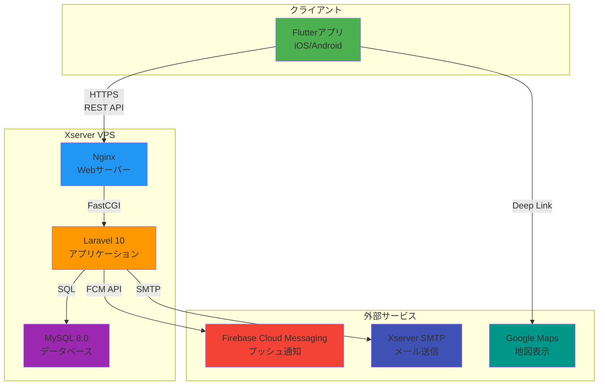
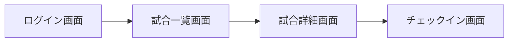

# 要件定義書

## 1. システム概要

### 1.1. システムの目的

### 1.2. システム全体構成図

以下のMermaid図を記載してください。



### 1.3. 技術スタック一覧

### 1.4. 開発環境・本番環境の構成

---

## 2. アーキテクチャ設計

### 2.1. レイヤー構成（クリーンアーキテクチャ/MVC等の採用パターン）

### 2.2. ディレクトリ構造（Laravel側、Flutter側）

### 2.3. 通信方式（REST API、認証フロー）

### 2.4. 状態管理方式（Flutter）

### 2.5. 依存関係図

---

## 3. 全18機能の詳細定義

要件定義書のF-USR-008(チェックイン機能)と同じフォーマットで、以下の全18機能について詳細定義を記載してください。

各機能には必ず以下の項目を含めること:

- ユーザーストーリー
- 概要
- 前提条件
- 事後状態(成功時)
- 入力(インプット) - 表形式
- 処理フロー - 番号付きリスト形式
- 出力(アウトプット) - 表形式
- 受け入れ条件(正常系・準正常系・異常系)
- エラー処理 - 表形式

### 管理者向け機能(F-ADM-001～F-ADM-010)

- **F-ADM-001**: ユーザー一覧表示機能
- **F-ADM-002**: ユーザー詳細表示機能
- **F-ADM-003**: ユーザー強制退会機能
- **F-ADM-004**: 管理者用試合一覧表示機能
- **F-ADM-005**: 管理者用試合詳細表示機能
- **F-ADM-006**: 試合登録機能
- **F-ADM-007**: 試合更新機能
- **F-ADM-008**: 試合削除機能
- **F-ADM-009**: プッシュ通知配信機能
- **F-ADM-010**: メール配信機能

### ユーザー向け機能(F-USR-001～F-USR-008)

- **F-USR-001**: アカウント登録機能
- **F-USR-002**: ログイン機能
- **F-USR-003**: ログアウト機能
- **F-USR-004**: パスワードリセット機能
- **F-USR-005**: 試合一覧表示機能
- **F-USR-006**: 試合参加登録機能
- **F-USR-007**: 試合詳細表示機能
- **F-USR-008**: チェックイン機能 [要件定義書に既に記載済み]

---

## 4. データベース設計

### 4.1. 物理ERD図

### 4.2. テーブル定義詳細

要件定義書のエンティティをもとに、物理テーブル名、カラム名、データ型、制約を記載

### 4.3. CREATE TABLE文(全テーブル)

以下のテンプレートに従って、全4テーブルのCREATE TABLE文を記載してください。

#### usersテーブル

```sql
CREATE TABLE users (
    user_id CHAR(36) PRIMARY KEY COMMENT 'ユーザーID(UUID v4)',
    email VARCHAR(255) NOT NULL UNIQUE COMMENT 'メールアドレス',
    password VARCHAR(255) NOT NULL COMMENT 'パスワード(Bcryptハッシュ)',
    nickname VARCHAR(4) NOT NULL UNIQUE COMMENT 'ニックネーム(固定4文字)',
    created_at TIMESTAMP NOT NULL DEFAULT CURRENT_TIMESTAMP COMMENT '登録日時',
    updated_at TIMESTAMP NOT NULL DEFAULT CURRENT_TIMESTAMP ON UPDATE CURRENT_TIMESTAMP COMMENT '更新日時',
    deleted_at TIMESTAMP NULL DEFAULT NULL COMMENT '退会日時(論理削除)'
) ENGINE=InnoDB DEFAULT CHARSET=utf8mb4 COLLATE=utf8mb4_unicode_ci COMMENT='ユーザー';
```

#### gamesテーブル、participationsテーブル、device_tokensテーブル

[同様に記載]

### 4.4. インデックス作成SQL文

```sql
-- usersテーブル
CREATE UNIQUE INDEX idx_email ON users(email);
CREATE UNIQUE INDEX idx_nickname ON users(nickname);
CREATE INDEX idx_deleted_at ON users(deleted_at);

-- gamesテーブル、participationsテーブル、device_tokensテーブル
[同様に全インデックスを記載]
```

### 4.5. トランザクション設計（どの処理をトランザクション境界とするか）

### 4.6. マスタデータ定義（都道府県ENUM、ポジションENUM等の初期データ)

### 4.7. マスタデータ投入SQL文

以下のSQL文を実行して、初期データを投入してください。

```sql
-- 都道府県マスタは games テーブルの CHECK 制約で定義済み

-- 初期管理者ユーザー作成(オプション)
INSERT INTO users (user_id, email, password, nickname, created_at, updated_at)
VALUES (
    UUID(),
    'admin@yourdomain.com',
    '$2y$10$92IXUNpkjO0rOQ5byMi.Ye4oKoEa3Ro9llC/.og/at2.uheWG/igi', -- password: "password"
    'かんり',
    NOW(),
    NOW()
);

-- 必要に応じて、テスト用の試合データなどを追加
INSERT INTO games (game_id, place_name, game_date_time, address, prefecture, latitude, longitude, acceptable_radius, status, fee, capacity, created_at, updated_at)
VALUES (
    UUID(),
    'テスト球場',
    DATE_ADD(NOW(), INTERVAL 7 DAY),
    '東京都新宿区西新宿2-8-1',
    '東京都',
    35.689614,
    139.691648,
    500,
    '募集中',
    1000,
    18,
    NOW(),
    NOW()
);
```

---

## 5. API設計

### 5.1. API設計方針

RESTful、命名規則、バージョニング

### 5.2. 認証・認可方式

JWT、トークンのライフタイム、リフレッシュトークン

### 5.3. APIエンドポイント一覧表

| エンドポイント | HTTPメソッド | 機能概要 | 認証要否 | 対応する要件定義の機能ID |
|---|---|---|---|---|
|  |  |  |  |  |

### 5.4. リクエスト/レスポンス仕様(全18APIの完全定義)

全18機能のAPIについて、以下のフォーマットで詳細を記載してください。

#### テンプレート

**[HTTPメソッド] [エンドポイント] - [機能ID]**

**リクエストヘッダー**

```
Content-Type: application/json
Authorization: Bearer {token}  # 認証必須の場合
```

**リクエストボディ(該当する場合)**

```json
{
  "field1": "type(説明)",
  "field2": "type(説明)"
}
```

**レスポンス(成功時)**

```json
{
  "data": {
    // 具体的なフィールドを記載
  },
  "meta": {
    "timestamp": "2025-10-18T12:34:56Z"
  }
}
```

**レスポンス(エラー時)**

```json
{
  "error": {
    "code": "ERR_CODE",
    "message": "エラーメッセージ"
  }
}
```

---

## 6. 画面設計

### 6.1. 画面遷移図



### 6.2. 画面一覧表

| 画面ID | 画面名 | 対応機能ID | 概要 |
|---|---|---|---|
|  |  |  |  |

### 6.3. 各画面の詳細設計（全15画面）

全15画面（ユーザー向け7画面+管理者向け8画面）について、以下のフォーマットで記載してください。

#### テンプレート

**画面名: [画面名]**

**画面ID**: [画面ID]

**対応機能ID**: [機能ID]

**概要**: [画面の概要説明]

**画面要素**

| 要素ID | 要素名 | 種類 | 必須/任意 | バリデーション | 備考 |
|---|---|---|---|---|---|
|  |  |  |  |  |  |

**操作フロー**

1. [操作1の説明]
2. [操作2の説明]

**画面遷移**

- [遷移先画面名]: [遷移条件]

**エラー表示**

- [エラーコード]: [エラーメッセージ]

---

## 7. セキュリティ設計

### 7.1. OWASP Top 10 対策

| 脅威 | 対策内容 | 実装方法 |
|---|---|---|
| A01:2021 – Broken Access Control | 認証・認可の適切な実装 | Laravel Sanctumによるトークン認証 |
| A02:2021 – Cryptographic Failures | 機密データの暗号化 | HTTPS通信、パスワードのBcryptハッシュ化 |

### 7.2. 認証・認可の実装詳細

- **認証方式**: Laravel Sanctum Personal Access Token
- **トークンの有効期限**: 24時間
- **トークンのストレージ**: Flutter Secure Storage

### 7.3. データ保護

- **個人情報の扱い**: メールアドレスは暗号化せず、論理削除で対応
- **パスワード**: Bcrypt (cost=10) でハッシュ化

### 7.4. 通信セキュリティ

- **HTTPS必須**: 全てのAPI通信はHTTPSで暗号化
- **証明書**: Let's Encryptを使用

### 7.5. 入力バリデーション

- **サーバーサイド**: Laravelのバリデーション機能を使用
- **クライアントサイド**: Flutter側でも基本的なバリデーションを実施

---

## 8. エラーハンドリング設計

### 8.1. エラーコード体系

| エラーコード | HTTP Status | エラー分類 | 説明 |
|---|---|---|---|
| ERR_AUTH_001 | 401 | 認証エラー | トークンが無効 |
| ERR_AUTH_002 | 401 | 認証エラー | トークンが期限切れ |
| ERR_VAL_001 | 400 | バリデーションエラー | 必須項目が未入力 |

### 8.2. エラーコード完全一覧(30種類以上)

[全てのエラーコードを表形式で記載]

### 8.3. エラーレスポンス形式

```json
{
  "error": {
    "code": "ERR_AUTH_001",
    "message": "認証トークンが無効です",
    "details": {
      "field": "token",
      "reason": "invalid_format"
    }
  }
}
```

---

## 9. 非機能要件

### 9.1. 性能要件

- **レスポンスタイム**: API応答時間 1秒以内（通常時）、3秒以内（ピーク時）
- **同時接続数**: 100接続まで対応

### 9.2. 可用性要件

- **稼働率**: 99%以上（月間ダウンタイム 7.2時間以内）
- **メンテナンス時間**: 月1回、深夜2時～4時（2時間以内）

### 9.3. 拡張性要件

- **ユーザー数**: 初期1,000ユーザー、最大10,000ユーザーまで対応可能
- **データ量**: 試合データ 初期100件、最大10,000件まで対応

### 9.4. 保守性要件

- **ログ保存期間**: 90日間
- **バックアップ**: 毎日深夜3時に自動バックアップ（保存期間30日）

---

## 10. 外部サービス連携設計

### 10.1. Firebase Cloud Messaging (FCM) 連携

**目的**: プッシュ通知の配信

**利用シーン**

- 試合登録完了通知
- 試合参加登録完了通知
- 試合開始1時間前の通知
- チェックイン完了通知
- 試合キャンセル通知
- 試合情報更新通知
- 管理者からの重要なお知らせ

**通知優先度**

- 高優先度: 試合キャンセル、重要なお知らせ
- 通常優先度: 試合登録完了、参加登録完了

### 10.2. メール配信 (Xserver SMTP)

**目的**: 重要な通知をメールでも送信

**メール形式**

- HTML形式を使用
- プレーンテキストのフォールバックも用意

**配信失敗時のリトライ**

- リトライ回数: 3回
- リトライ間隔: 5分、15分、30分(指数バックオフ)
- 3回失敗した場合はログに記録し、手動対応

---

## 11. バッチ処理設計

### 11.1. 試合ステータス自動更新バッチ

**実行タイミング**: 毎時0分(cron: 0 * * * *)

**更新ロジック**:

- 現在時刻がgame_date_timeより1時間以上経過＆ステータスが「募集中」「満員」の場合 → 「開催済み」に更新

### 11.2. 並列制御

- データベースロックを使用
- SELECT ... FOR UPDATEでレコードをロック
- 同時実行防止のため、バッチ実行フラグをRedisに保存(TTL: 1時間)

---

## 12. ログ設計

### 12.1. ログフォーマット

JSON形式で出力

```json
{
  "timestamp": "2025-10-18T12:34:56Z",
  "level": "INFO",
  "message": "User logged in",
  "context": {
    "user_id": "xxx-xxx-xxx",
    "ip_address": "192.168.1.1",
    "user_agent": "..."
  }
}
```

### 12.2. ログレベル

- **DEBUG**: 開発時のデバッグ情報
- **INFO**: 通常の動作ログ
- **WARNING**: 警告(処理は継続)
- **ERROR**: エラー(処理は失敗)
- **CRITICAL**: 致命的エラー(システム停止)

---

## 📝 出力時の注意事項

### 1. 具体性を重視

抽象的な説明ではなく、実装レベルで参照できる具体的な内容を記載してください

例: 「認証を行う」ではなく、「Laravel Sanctumを使用し、Personal Access Tokenで認証し、有効期限は24時間とする」

### 2. 上記の決定ルールを必ず遵守

技術選定、命名規約、レスポンス構造、バリデーションルールなど、全て上記の決定ルールに従ってください

判断に迷う箇所があっても、上記ルールを優先してください

### 3. 図表の活用

Mermaid記法で図を記載してください

システム構成図、画面遷移図、シーケンス図など

### 4. 要件定義書との対応

各設計項目が要件定義書のどの機能に対応するか明記してください

機能ID(F-USR-001等)を参照してください

### 5. 完全性

要件定義書に記載された全18機能について、API設計・画面設計を漏れなく記載してください

全18機能のAPIエンドポイント、画面、処理フローを漏れなく記載してください

### 6. 実装可能性

Laravel 10、Flutter 3.16で実装可能な技術のみを選択してください

利用するパッケージ名も具体的に記載してください

### 7. 一貫性の維持

命名規約、レスポンス構造、エラーハンドリングなど、全て統一されたルールで記載してください

同じ概念には同じ用語を使用してください

---

## ✅ 出力の必須要件(CRITICAL)

以下の項目は必ず全て完全に記載してください。一つでも欠けている場合は、基本設計書として不完全です。

**チェックリスト**

- [ ] 全18機能の詳細定義(ユーザーストーリー、前提条件、処理フロー、エラー処理を含む)
- [ ] 全18APIのリクエスト/レスポンスJSONスキーマ
- [ ] 全画面(ユーザー向け7画面+管理者向け8画面)の詳細設計
- [ ] エラーコード完全一覧表(30種類以上)
- [ ] プッシュ通知テンプレート7種類の完全定義
- [ ] メールテンプレート7種類の完全定義(HTML形式)
- [ ] CREATE TABLE文(4テーブル全て)
- [ ] インデックス作成SQL文(全インデックス)
- [ ] マスタデータ投入SQL文
- [ ] 環境変数一覧(.envファイルの全項目)
- [ ] Nginx設定ファイル(完全版)
- [ ] Laravelデプロイコマンド一覧
- [ ] Flutterビルドコマンド一覧(iOS/Android)
- [ ] Firebase FCM初期化コード
- [ ] FCMデバイストークン登録コード
- [ ] 距離計算アルゴリズム実装コード
- [ ] バッチ処理のcron設定
- [ ] バッチ処理の実装コード
- [ ] システム構成図(Mermaid)
- [ ] 画面遷移図(Mermaid、ユーザー向け+管理者向け)
- [ ] OWASP Top 10対策の具体的実装方法(表形式)
- [ ] ログフォーマットJSONスキーマ(3種類)
- [ ] テストケース一覧(単体・統合・E2E)

**出力形式の注意**

- 全てのコードは完全なものを記載し、「...」や「[以下省略]」などの省略表現を使用しない
- 全てのテーブルは表形式で記載する
- 全ての図はMermaid記法で記載する
- 全てのSQLは実行可能な完全なものを記載する
- 全てのコード例は動作する完全なものを記載する

**一貫性の確保**

- 命名規約は全て上記の決定ルールに従う
- レスポンス構造は全て決定フォーマットに従う
- エラーコードは完全一覧表に記載されたもののみを使用する
- バリデーションルールは決定ルールに従う

---

## 📤 出力形式

Markdown形式で出力してください

長文になる場合は、章ごとに分割して出力しても構いません

表は可能な限りMarkdownテーブル形式で記載してください

---

それでは、基本設計書の作成を開始してください。再度述べます、Claudeは間違えることがあります。回答内容を必ずご確認ください。 Sonnet 4.5
