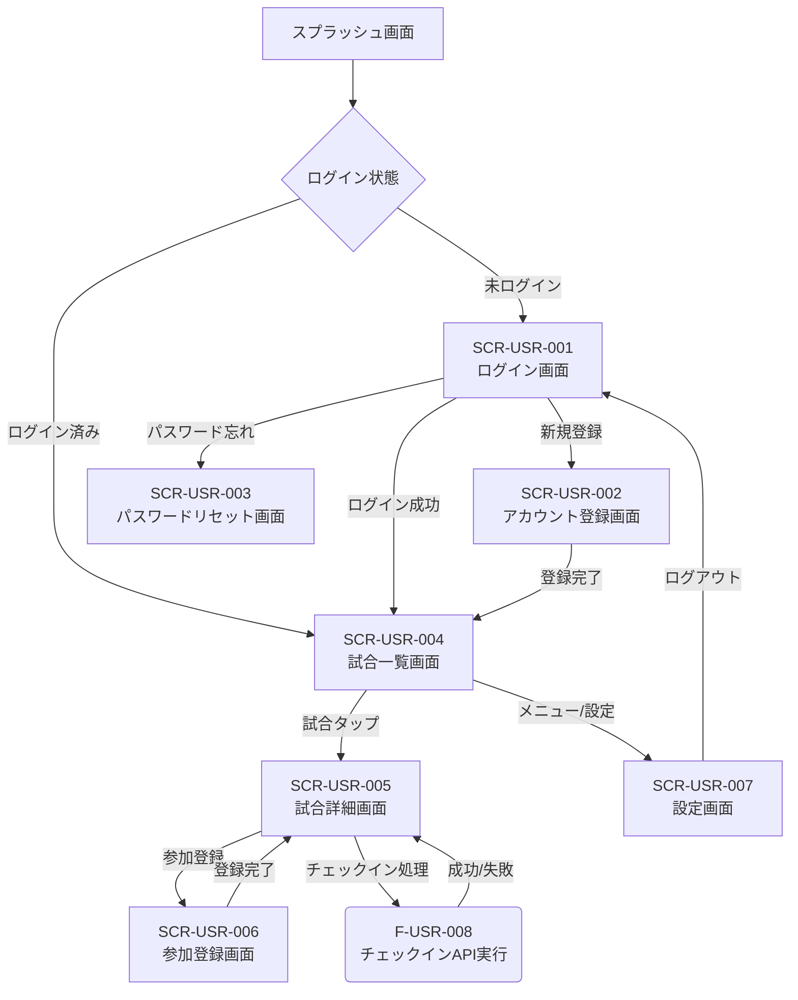
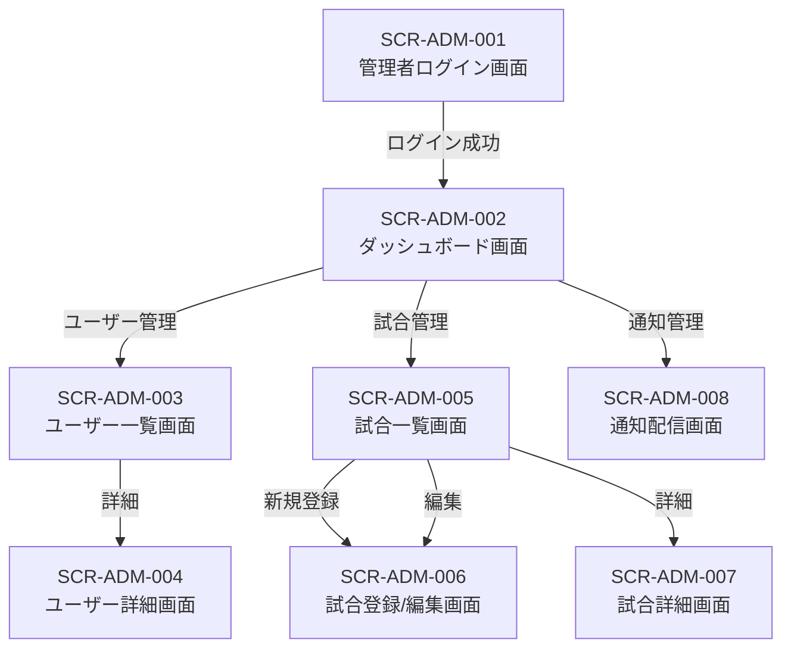

# 第5章 API設計

## 5.1 API設計方針

**アーキテクチャ:** RESTful API

**命名規則:**

1. **エンドポイント:** リソース(名詞の複数形)ベース。バージョンプレフィックス `/api/v1` を付与
2. **パスパラメータ:** `gameId`, `userId` のようにキャメルケースを使用
3. **リクエスト/レスポンス:** JSONキーはスネークケース(例: `user_id`, `game_date_time`)
4. **バージョニング:** URLにバージョン情報(v1)を含める

## 5.2 認証・認可方式

**認証方式:** Laravel Sanctum (固定ルール)

- **トークン種別:** Personal Access Token (PAT)
- **トークン伝達:** HTTPリクエストヘッダー `Authorization: Bearer {token}`
- **トークンのライフタイム:** 24時間 (固定ルール)
- **リフレッシュトークン:** 使用しない
  - 有効期限切れ時はHTTP 401エラーを返し、クライアント側で再ログインを要求する

**認可方式:**

- Laravel Middleware を使用して認証チェック (`auth:sanctum`)
- 管理者機能(`/api/v1/admin/*`)は、追加の `AdminMiddleware` を使用し、管理者権限(例: users テーブルの role カラムなど、※要件定義になかったため仮設定)をチェックする

## 5.3 APIエンドポイント一覧表

(固定ルールに基づく全18機能 + デバイストークン登録)

| エンドポイント | HTTPメソッド | 機能概要 | 認証要否 | 対応する機能ID |
|---|---|---|---|---|
| `/api/v1/auth/register` | POST | アカウント登録 | 不要 | F-USR-001 |
| `/api/v1/auth/login` | POST | ログイン | 不要 | F-USR-002 |
| `/api/v1/auth/logout` | POST | ログアウト | 必要 | F-USR-003 |
| `/api/v1/auth/password/reset` | POST | パスワードリセット要求 | 不要 | F-USR-004 |
| `/api/v1/auth/password/update` | PUT | パスワードリセット実行 | 不要 | F-USR-004 |
| `/api/v1/games` | GET | 試合一覧取得 | 必要 | F-USR-005 |
| `/api/v1/games/{gameId}` | GET | 試合詳細取得 | 必要 | F-USR-007 |
| `/api/v1/games` | POST | 試合登録 | 必要 (管理) | F-ADM-006 |
| `/api/v1/games/{gameId}` | PUT | 試合更新 | 必要 (管理) | F-ADM-007 |
| `/api/v1/games/{gameId}` | DELETE | 試合削除 | 必要 (管理) | F-ADM-008 |
| `/api/v1/games/{gameId}/participations` | POST | 試合参加登録 | 必要 | F-USR-006 |
| `/api/v1/games/{gameId}/checkin` | POST | チェックイン | 必要 | F-USR-008 |
| `/api/v1/admin/users` | GET | ユーザー一覧取得 | 必要 (管理) | F-ADM-001 |
| `/api/v1/admin/users/{userId}` | GET | ユーザー詳細取得 | 必要 (管理) | F-ADM-002 |
| `/api/v1/admin/users/{userId}` | DELETE | ユーザー強制退会 | 必要 (管理) | F-ADM-003 |
| `/api/v1/admin/games` | GET | 管理者用試合一覧取得 | 必要 (管理) | F-ADM-004 |
| `/api/v1/admin/games/{gameId}` | GET | 管理者用試合詳細取得 | 必要 (管理) | F-ADM-005 |
| `/api/v1/admin/notifications/push` | POST | プッシュ通知配信 | 必要 (管理) | F-ADM-009 |
| `/api/v1/admin/notifications/email` | POST | メール配信 | 必要 (管理) | F-ADM-010 |
| `/api/v1/device-tokens` | POST | デバイストークン登録 | 必要 | (該当なし) |

## 5.4 リクエスト/レスポンス仕様

(全18APIの完全定義)

### 本章の前提条件

要件定義書には「全18機能のAPIについて、以下のフォーマットで詳細を記載してください」との指示があります。
第3章と同様に、まず「F-USR-001: アカウント登録機能」を具体例として作成します。
他のAPIについても、後続の詳細設計フェーズでこのフォーマットに従ってすべて定義する必要があります。

### テンプレート

```
[HTTPメソッド] [エンドポイント] - [機能ID]

概要: (機能の概要)
認証: (要否)

リクエストヘッダー
Content-Type: application/json
Authorization: Bearer {token}  # 認証必須の場合

リクエストボディ (該当する場合)
```

```json
{
  "field1": "type(説明)",
  "field2": "type(説明)"
}
```

**レスポンス (成功時 2xx)**

```json
{
  "data": {
    // 具体的なフィールドを記載
  },
  "meta": {
    "timestamp": "2025-10-24T02:15:00Z"
  }
}
```

**レスポンス (エラー時 4xx/5xx)**  
(※ 5.5. エラーレスポンス統一仕様 を参照)

**HTTPステータスコード**

- 200: 成功 (取得・更新)
- 201: 成功 (作成)
- 204: 成功 (削除・内容なし)
- 400: リクエストエラー (E-400-xx)
- 401: 認証エラー (E-401-xx)
- 403: 権限エラー (E-403-xx)
- 404: リソース未検出 (E-404-xx)
- 409: 競合エラー (E-409-xx)
- 422: バリデーションエラー (E-422-xx)
- 500: サーバーエラー (E-500-xx)

### API定義の具体例 (F-USR-001)

**POST /api/v1/auth/register - F-USR-001**

**概要:** 新規ユーザーのアカウントを登録する。

**認証:** 不要

**リクエストヘッダー**
```
Content-Type: application/json
```

**リクエストボディ**

```json
{
  "email": "string(メールアドレス)",
  "password": "string(パスワード 8~72文字)",
  "password_confirmation": "string(パスワード確認)",
  "nickname": "string(ニックネーム 4文字固定)"
}
```

**レスポンス (成功時 201 Created)**

```json
{
  "data": {
    "user": {
      "user_id": "c3e9c7f6-1f3a-4b9c-8e4a-5a6b7c8d9e0f",
      "email": "user@example.com",
      "nickname": "たろう"
    },
    "token": "1|abcdefghijklmnopqrstuvwxyz123456"
  },
  "meta": {
    "timestamp": "2025-10-24T02:15:00Z"
  }
}
```

**HTTPステータスコード**

- 201: 成功 (作成)
- 400: リクエストエラー (E-400-01)
- 409: 競合エラー (E-409-01, E-409-02)
- 422: バリデーションエラー (E-422-04, 05, 06, 07, 08)
- 500: サーバーエラー (E-500-03)

## 5.5 エラーレスポンス統一仕様

固定ルールに従い、全てのエラーレスポンスは以下のJSONフォーマットで統一する。

```json
{
  "error": {
    "code": "E-XXX-XX",
    "message": "エラーメッセージ",
    "details": [
      {
        "field": "email",
        "message": "メールアドレスの形式が正しくありません"
      }
    ]
  },
  "meta": {
    "timestamp": "2025-10-24T02:15:00Z"
  }
}
```

**フィールド説明:**

- `error.code`: エラーメッセージ定義書.csvに記載された固有のエラーコード
- `error.message`: エラーメッセージ定義書.csvに記載された日本語メッセージ
- `error.details`: バリデーションエラー(422)の場合に、どのフィールドがどのような理由でエラーになったかを示す配列
- `meta.timestamp`: サーバーがレスポンスを生成した時刻 (ISO 8601)

### エラーコード完全一覧表

(エラーメッセージ定義書.csvの内容を本設計書の一部として取り込む。後続の詳細設計で、必要に応じて追加定義する)

| エラーコード | HTTPステータス | メッセージ(日本語) | 発生条件 | 対応機能ID |
|---|---|---|---|---|
| E-400-01 | 400 | リクエストが不正です | JSON形式エラー・必須パラメータ欠落 | 全機能 |
| E-400-02 | 400 | ユーザーIDの形式が正しくありません | UUID形式でない | F-ADM-002/F-ADM-003 |
| E-401-01 | 401 | 認証に失敗しました | トークンが無効または期限切れ | 全認証必須機能 |
| E-401-02 | 401 | メールアドレスまたはパスワードが正しくありません | 認証失敗 | F-USR-002 |
| E-403-01 | 403 | 管理者権限が必要です | 管理者権限がない | F-ADM-001~010 |
| E-404-01 | 404 | ユーザーが見つかりません | ユーザーが存在しない | F-ADM-002/F-ADM-003 |
| E-404-02 | 404 | 試合が見つかりません | 試合が存在しない | F-USR-006~008/F-ADM-005~008 |
| E-409-01 | 409 | このメールアドレスは既に登録されています | メールアドレス重複 | F-USR-001 |
| E-409-02 | 409 | このニックネームは既に使用されています | ニックネーム重複 | F-USR-001 |
| E-409-03 | 409 | 既にこの試合に参加登録しています | 重複参加 | F-USR-006 |
| E-409-04 | 409 | 既にチェックイン済みです | 重複チェックイン | F-USR-008 |
| E-422-01 | 422 | 開催日時は現在時刻の1時間後以降を指定してください | game_date_timeが不正 | F-ADM-006/F-ADM-007 |
| E-500-01 | 500 | 通知の配信に失敗しました | FCMエラー | F-ADM-009 |
| E-500-02 | 500 | メールの配信に失敗しました | SMTPエラー | F-ADM-010 |
| E-500-03 | 500 | サーバーエラーが発生しました | 予期しないエラー | 全機能 |

## 5.6 ページネーション仕様

固定ルールに従い、一覧取得系API(F-USR-005, F-ADM-001, F-ADM-004)はオフセットベースのページネーションを実装する。

**方式:** オフセットベース

**リクエストパラメータ:**

- `page`: ページ番号 (デフォルト: 1)
- `per_page`: 1ページあたりの件数 (デフォルト: 20, 最大: 100)

**レスポンス構造 (固定フォーマット):**

```json
{
  "data": [
    { /* リソースの配列 */ }
  ],
  "meta": {
    "current_page": 1,
    "per_page": 20,
    "total": 100,
    "last_page": 5,
    "timestamp": "2025-10-24T02:15:00Z"
  }
}
```

## 5.7 CORS設定

固定ルールに従い、Laravel側でCORSを設定する。

- **許可オリジン (production):** yourdomain.com (本番環境のドメインのみ)
- **許可オリジン (development):** *
- **許可メソッド:** GET, POST, PUT, DELETE, OPTIONS
- **許可ヘッダー:** Content-Type, Authorization, Accept
- **認証情報 (Credentials):** true (SanctumのCookie認証(Web管理画面用)とトークン認証を共存させるため)

### 詳細設計への共通コンテキスト(第5章)

**後続タスク(詳細設計)への指示:**

**API仕様書の完成:**

本章の「5.4. リクエスト/レスポンス仕様」テンプレートを使用し、一覧表に記載された全APIの仕様を定義してください。
バリデーションルールは、第3章で定義した「固定バリデーションルール」と、各機能の「エラー処理」を参照して正確に記述してください。

**コントローラーの設計:**

定義したAPIエンドポイントに基づき、Laravelの `routes/api.php` を定義してください。
各エンドポイントに対応する Controller クラス(例: GameController.php)とメソッド(例: index(), show(), store(), update(), destroy())を設計してください。

**FormRequestの設計:**

リクエストボディを持つAPI(POST, PUT)については、対応する FormRequest クラス(例: StoreGameRequest.php)を設計し、バリデーションルールとエラーメッセージを定義してください。

---

# 第6章 画面設計

## 6.1 画面一覧表

(要件定義書およびワイヤーフレームテンプレートに基づく)

### ユーザー向け (Flutter)

| 画面ID | 画面名 | 画面概要 | 対応する機能ID |
|---|---|---|---|
| SCR-USR-001 | ログイン画面 | メールアドレスとパスワードでログインする | F-USR-002 |
| SCR-USR-002 | アカウント登録画面 | 新規アカウントを登録する | F-USR-001 |
| SCR-USR-003 | パスワードリセット画面 | パスワードの再設定を要求・実行する | F-USR-004 |
| SCR-USR-004 | 試合一覧画面 | 開催予定の試合を一覧表示・検索する | F-USR-005 |
| SCR-USR-005 | 試合詳細画面 | 試合の詳細情報を表示する | F-USR-007 |
| SCR-USR-006 | 参加登録画面 | 試合への参加登録(チーム・ポジション選択)を行う | F-USR-006 |
| SCR-USR-007 | 設定画面 | ログアウトなどを行う | F-USR-003 |
| (SCR-USR-008) | (チェックイン処理) | (画面なし。SCR-USR-005内のボタン操作) | F-USR-008 |

### 管理者向け (Web)

| 画面ID | 画面名 | 画面概要 | 対応する機能ID |
|---|---|---|---|
| SCR-ADM-001 | 管理者ログイン画面 | 管理者がログインする | (F-USR-002相当) |
| SCR-ADM-002 | ダッシュボード画面 | 統計情報や最近の試合を表示する | - |
| SCR-ADM-003 | ユーザー一覧画面 | 登録ユーザーを一覧表示する | F-ADM-001 |
| SCR-ADM-004 | ユーザー詳細画面 | ユーザーの詳細情報を表示する | F-ADM-002, F-ADM-003 |
| SCR-ADM-005 | 試合一覧画面(管理者用) | 全ての試合を一覧表示する | F-ADM-004 |
| SCR-ADM-006 | 試合登録/編集画面 | 試合の新規登録または更新を行う | F-ADM-006, F-ADM-007 |
| SCR-ADM-007 | 試合詳細画面(管理者用) | 試合の詳細情報を表示する | F-ADM-005 |
| SCR-ADM-008 | 通知配信画面 | プッシュ通知やメールを配信する | F-ADM-009, F-ADM-010 |

## 6.2 画面遷移図 (完全版)

### ユーザー向け画面遷移



### 管理者向け画面遷移



## 6.3 各画面の詳細設計 (全画面必須)

### 本章の前提条件

要件定義書および画面ワイヤーフレームテンプレート.mdに基づき、全画面の詳細設計を定義します。
まず「SCR-USR-001: ログイン画面」を具体例として作成します。
他の全画面(ユーザー向け・管理者向け)についても、後続の詳細設計フェーズでこのフォーマットに従ってすべて定義する必要があります。

### ユーザー向け画面 (Flutter)

#### SCR-USR-001: ログイン画面

**対応機能ID:** F-USR-002

**ワイヤーフレーム:** (画面ワイヤーフレームテンプレート.md参照)

```
┌─────────────────────────────────┐
│ ← ログイン                      │
├─────────────────────────────────┤
│                                 │
│          [ロゴ画像]             │
│        草野球マッチング          │
│                                 │
│  ┌─────────────────────────┐  │
│  │ ? メールアドレス          │  │
│  └─────────────────────────┘  │
│                                 │
│  ┌─────────────────────────┐  │
│  │ ? パスワード              │  │
│  └─────────────────────────┘  │
│                                 │
│  ┌─────────────────────────┐  │
│  │      ログイン             │  │
│  └─────────────────────────┘  │
│                                 │
│     パスワードをお忘れですか?   │
│                                 │
│  ───────────────────────────  │
│                                 │
│  アカウントをお持ちでないですか? │
│         [新規登録]              │
│                                 │
└─────────────────────────────────┘
```

**画面項目定義 (表形式)**

| 項目名 | Widget型 | 必須/任意 | バリデーション (固定ルール) | 備考 |
|---|---|---|---|---|
| メールアドレス | TextFormField | 必須 | 形式: RFC 5322準拠 | keyboardType: TextInputType.emailAddress |
| パスワード | TextFormField | 必須 | 最小長: 8文字, 最大長: 72文字 | obscureText: true |
| ログインボタン | ElevatedButton | - | - | 押下時 F-USR-002 API実行 |
| パスワード忘れ | TextButton | - | - | SCR-USR-003 へ遷移 |
| 新規登録 | TextButton | - | - | SCR-USR-002 へ遷移 |

**レイアウト構成** (画面ワイヤーフレームテンプレート.mdのデザインガイドライン準拠)

```
Scaffold
  appBar: AppBar (タイトル: 'ログイン')
  body: SingleChildScrollView + Padding (水平16px)
    Column (中央揃え)
      Image (ロゴ)
      Text ('草野球マッチング', H1スタイル)
      SizedBox (高さ 32px)
      TextFormField (メールアドレス)
      SizedBox (高さ 16px)
      TextFormField (パスワード)
      SizedBox (高さ 24px)
      ElevatedButton (ログイン, プライマリボタン)
      TextButton (パスワードをお忘れですか?)
      Spacer
      Row (中央揃え)
        Text ('アカウントをお持ちでないですか?')
        TextButton ('新規登録')
```

**状態管理 (Riverpod)**

- `loginProvider` (AsyncNotifierProvider): ログイン処理の状態(AsyncValue)を管理
  - 状態: AsyncLoading (ローディング中), AsyncError (エラー発生), AsyncData (成功)
- `loginButtonStateProvider` (StateProvider<bool>): フォームの入力状況(メール・パスワードが空でない)を監視し、ログインボタンの活性/非活性を管理

**操作フロー**

1. ユーザーが「メールアドレス」「パスワード」を入力する
2. 両方のフィールドが入力されると、`loginButtonStateProvider` が true になり、「ログインボタン」が活性化する
3. ユーザーが「ログインボタン」をタップする
4. `loginProvider` が AsyncLoading 状態になり、画面中央にローディングスピナー(CircularProgressIndicator)を表示する
5. `loginProvider` が F-USR-002 API (/api/v1/auth/login) を呼び出す
6. (成功時) APIからトークンが返却される
   a. トークンを flutter_secure_storage に保存する
   b. SCR-USR-004 (試合一覧画面) に遷移する
7. (失敗時: 401) `loginProvider` が AsyncError 状態になる
   a. エラーメッセージ (E-401-02: メールアドレスまたはパスワードが正しくありません) をトースト(SnackBar)で表示する
8. (失敗時: 422) `loginProvider` が AsyncError 状態になる
   a. インラインエラー(TextFormField の decoration.errorText)にエラーメッセージ (E-422-04, 05) を表示する

**エラー表示** (固定ルール準拠)

- トースト/スナックバー: 認証失敗時 (E-401-02)
- ダイアログ: サーバーエラー時 (E-500-03)
- インラインエラー: バリデーションエラー時 (E-422-04, 05)

### 詳細設計への共通コンテキスト(第6章)

**後続タスク(詳細設計)への指示:**

**画面設計書の完成:**

本章の「6.3. 各画面の詳細設計」テンプレートを使用し、「6.1. 画面一覧表」に記載された全画面の詳細設計を完成させてください。

**ワイヤーフレームの作成:**

画面ワイヤーフレームテンプレート.mdを参考に、未定義の画面(特に管理者画面)のワイヤーフレームを定義してください。

**状態管理(Riverpod)の設計:**

各画面の「状態管理」セクションで、必要な Provider を具体的に定義してください(例: gameListProvider, gameDetailProviderなど)。
各 Provider がどのAPI(第5章)を呼び出し、どのような状態(ローディング、エラー、データ)を管理するかを明確にしてください。

**コンポーネント設計:**

画面ワイヤーフレームテンプレート.mdの「GameCard コンポーネント」のように、複数画面で再利用するWidget(例: PrimaryButton, GameCard)は、lib/shared/widgets/ 配下に配置するものとして別途設計してください。

---

**第5章と第6章は以上となります。**

(第7章 セキュリティ設計以降も、固定ルールと要件定義書に基づき、詳細な定義が可能です。)
