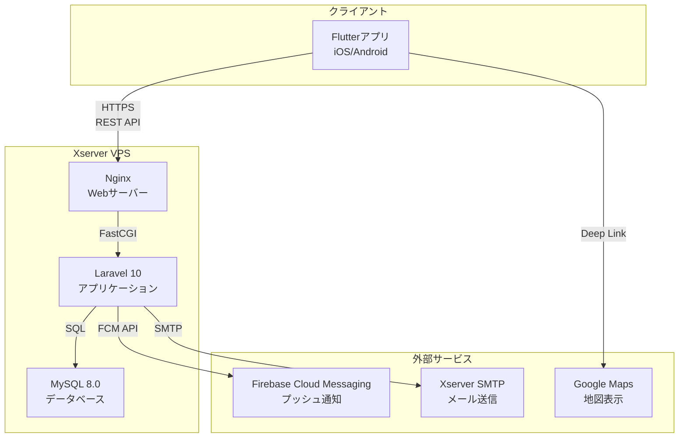

# 詳細設計書：草野球マッチングアプリ

## 第1章 システム概要 (詳細定義)

本章は、基本設計書 第1章 で定義されたシステム概要、システム全体構成図、技術スタック、環境構成を確定するものとする。

以降の全設計・実装フェーズ（第2章～第19章）は、本章で定義された以下の制約に厳密に従うこと。

---

### 1.1. システム全体構成図 (確定)

基本設計書に基づき、アーキテクチャは以下の構成で確定する。

---

### 1.2. 技術スタック (確定)

基本設計書に基づき、使用する技術スタックを以下で固定する。これ以外の技術の導入は原則禁止とする。

| 領域 | 技術 | バージョン/詳細 | 備考 |
|------|------|----------------|------|
| **フロントエンド** | Flutter | 3.16 (要件定義書に基づく) | iOS / Android |
| **状態管理 (Flutter)** | Riverpod | 2.x | 固定ルール |
| **トークン保存 (Flutter)** | flutter_secure_storage | - | 固定ルール |
| **位置情報 (Flutter)** | geolocator | - | 固定ルール |
| **バックエンド** | Laravel | 10 | - |
| **Webサーバー** | Nginx | - | Xserver VPS |
| **データベース** | MySQL | 8.0 | Xserver VPS |
| **認証 (Laravel)** | Laravel Sanctum | Personal Access Token | 固定ルール |
| **プッシュ通知** | Firebase Cloud Messaging | - | 外部連携 |
| **メール送信** | Xserver SMTP | - | 外部連携 |
| **地図連携** | Google Maps | ディープリンク | 外部連携 |

---

## 第2章 アーキテクチャ設計 (詳細定義)

基本設計書 第2章 の「詳細設計への共通コンテキスト」で指示されたタスクに基づき、プロジェクトの主要クラスと責務を以下の通り定義する。

---

### 2.1. バックエンド (Laravel) クラス定義

基本設計書のレイヤー構成（Controller → Service → Repository）に基づき、以下のクラス群を定義する。

| レイヤー | クラス（例） | 責務 (設計指示) |
|---------|-------------|----------------|
| **Controller** | AuthController | - HTTPリクエストの受付 - LoginRequest, RegisterRequest 等のFormRequestによるバリデーション - AuthService のメソッド (login, register, logout) を呼び出す - Sanctumトークンを含むJSONレスポンスを返却 |
| | GameController | - 試合関連エンドポイントの受付 - StoreGameRequest 等のFormRequestによるバリデーション - GameService のメソッドを呼び出す - GameResource を使用してJSONレスポンスを返却 |
| | CheckinController | - POST /api/v1/games/{id}/checkin の受付 - CheckinService を呼び出す |
| **Service** | AuthService | - login, register のビジネスロジック - UserRepository を呼び出し、Bcryptでのハッシュ化を行う - Mail::queue で AccountRegistered メールを送信（第10章） |
| | GameService | - 試合に関する主要なビジネスロジック - createGame (試合登録), updateGame (試合更新), addParticipant (参加登録) 等を実装 - GameRepository, ParticipationRepository を呼び出す - トランザクション管理（DB::transaction） |
| | CheckinService | - F-USR-008（チェックイン）のロジック - 時間帯制御、距離計算（DistanceCalculator）、ステータス更新のロジックを集約 |
| **Repository** | UserRepository | - User モデル (Eloquent) の操作をカプセル化 - findById, findByEmail, create 等のメソッドを定義 |
| | GameRepository | - Game モデルの操作をカプセル化 - findById, create, update, getActiveList (一覧取得) 等のメソッドを定義 |
| | ParticipationRepository | - Participation モデルの操作 - findByUserAndGame, create, updateStatus 等を定義 |
| **Request** | RegisterRequest | - F-USR-001のバリデーションルール - email (必須, email, unique), password (必須, 8-72文字, 2種以上, confirmed), nickname (必須, 4文字, unique) を定義 |
| | StoreGameRequest | - F-ADM-006のバリデーションルール - place_name (必須), game_date_time (必須, future 1h), capacity (必須, min:18) 等を定義 |
| **Resource** | UserResource | - data.user のJSON構造（user_id, email, nickname）を定義 |
| | GameResource | - data (試合詳細) のJSON構造を定義 |

---

### 2.2. フロントエンド (Flutter) クラス/Provider定義

基本設計書のレイヤー構成（Presentation → Application(State) → Data(Repository)）および固定ルールに基づき、以下のクラス群を定義する。

| レイヤー | クラス/Provider（例） | 責務 (設計指示) |
|---------|---------------------|----------------|
| **Presentation (UI)** | LoginScreen | - SCR-USR-001 のUI (Widget) を構築 - TextFormField の入力を State で管理 - [ログイン]ボタン押下時に ref.read(authProvider.notifier).login() を呼び出す - ref.watch(authProvider) を監視し、AsyncLoading ならスピナー表示 |
| | GameListScreen | - SCR-USR-004 のUI - ref.watch(gameListProvider) を監視し、状態に応じて ListView.builder, CircularProgressIndicator, ErrorText を表示 |
| | GameDetailScreen | - SCR-USR-005 のUI - ref.watch(gameDetailProvider(gameId)) を監視 - [チェックイン]ボタン押下時に ref.read(checkinProvider.notifier).executeCheckin(gameId) を呼び出す |
| **Application (State)** | authProvider | - AsyncNotifierProvider として実装 - ログイン状態 (User?) を管理 - login, register, logout メソッドを実装 - AuthRepository を呼び出し、成功時に TokenStorageService にトークンを保存 |
| | gameListProvider | - AsyncNotifierProvider として実装 - 試合一覧の状態 (AsyncValue\<List\<Game\>\>) を管理 - GameRepository を呼び出してデータを取得 - ページネーション、フィルターロジックを保持 |
| | checkinProvider | - AsyncNotifierProvider として実装 - チェックイン処理の状態 (AsyncValue\<void\>) を管理 - CheckinRepository の executeCheckin() を呼び出す |
| **Data (Repository)** | AuthRepository | - APIクライアント (Dioなど) を使用して /api/v1/auth/* と通信 - login (email, pass) は token を返す - register (email, pass, name) は token を返す |
| | GameRepository | - /api/v1/games と通信 - fetchGameList, fetchGameDetail 等を実装 - JSONレスポンスを Game モデル (Dart) に変換 |
| | CheckinRepository | - チェックイン処理を集約 - (1) geolocator で位置情報を取得 - (2) POST /api/v1/games/{id}/checkin APIを呼び出す |
| **Core (Service / Util)** | TokenStorageService | - flutter_secure_storage のラッパー - saveToken(token), getToken(), deleteToken() メソッドを提供 |
| | DistanceCalculator | - calculate, isWithinRange メソッドを持つUtilクラス - lib/core/utils/ に配置 |

---

## コード生成AIへの共通コンテキスト (第1章・第2章)

**目的:**

第1章・第2章の定義に基づき、プロジェクトの骨格（スケルトン）となるディレクトリ構造、クラスファイル、インターフェースを生成する。

**指示:**

### ディレクトリ構造の生成 (Laravel)

- 基本設計書の「2.2. ディレクトリ構造 (Laravel)」に基づき、`app/Http/Controllers`, `app/Services`, `app/Repositories`, `app/Http/Requests`, `app/Models` ディレクトリを作成してください。

### クラスファイルの生成 (Laravel)

- 上記の「2.1. バックエンド (Laravel) クラス定義」表に基づき、指定されたクラスファイル（例: GameController.php, GameService.php, GameRepository.php, StoreGameRequest.php）をすべて空のクラスとして作成してください。

### 依存関係の注入 (DI) (Laravel)

- Controllerクラス（例: GameController）の `__construct` メソッドで、対応する Service（例: GameService $gameService）を型宣言により注入してください。
- Serviceクラス（例: GameService）の `__construct` メソッドで、対応する Repository（例: GameRepository $gameRepository, ParticipationRepository $participationRepository）を注入してください。

### 責務の厳守 (Laravel)

- Controller のメソッド内にはロジックを書かず、`$this->gameService->method()` のように Service のメソッドを呼び出すだけにしてください。
- Service のメソッド内には Eloquent（例: `Game::find()`）を直接書かず、必ず `$this->gameRepository->findById()` のように Repository のメソッドを呼び出してください。
- Repository のみが Eloquent モデル（Game::class）を操作する責務を持ちます。

### ディレクトリ構造の生成 (Flutter)

- 基本設計書の「2.2. ディレクトリ構造 (Flutter)」に基づき、`lib/features/auth/`, `lib/features/game/`, `lib/features/checkin/` ディレクトリを作成し、それぞれの下に `presentation` (UI), `application` (State), `data` (Repository) のサブディレクトリを作成してください。

### クラス/Providerの生成 (Flutter)

- 上記の「2.2. フロントエンド (Flutter) クラス/Provider定義」表に基づき、authProvider などの AsyncNotifierProvider を `application` ディレクトリに定義してください。
- AuthRepository などの Repository クラスを `data` ディレクトリに定義してください。
- LoginScreen などの Screen (Widget) を `presentation` ディレクトリに定義してください。

### 固定コードの実装 (Flutter)

- `lib/core/utils/` に `distance_calculator.dart` を作成し、基本設計書 第9章 に記載されている DistanceCalculator の Haversine formula コードを実装してください。
