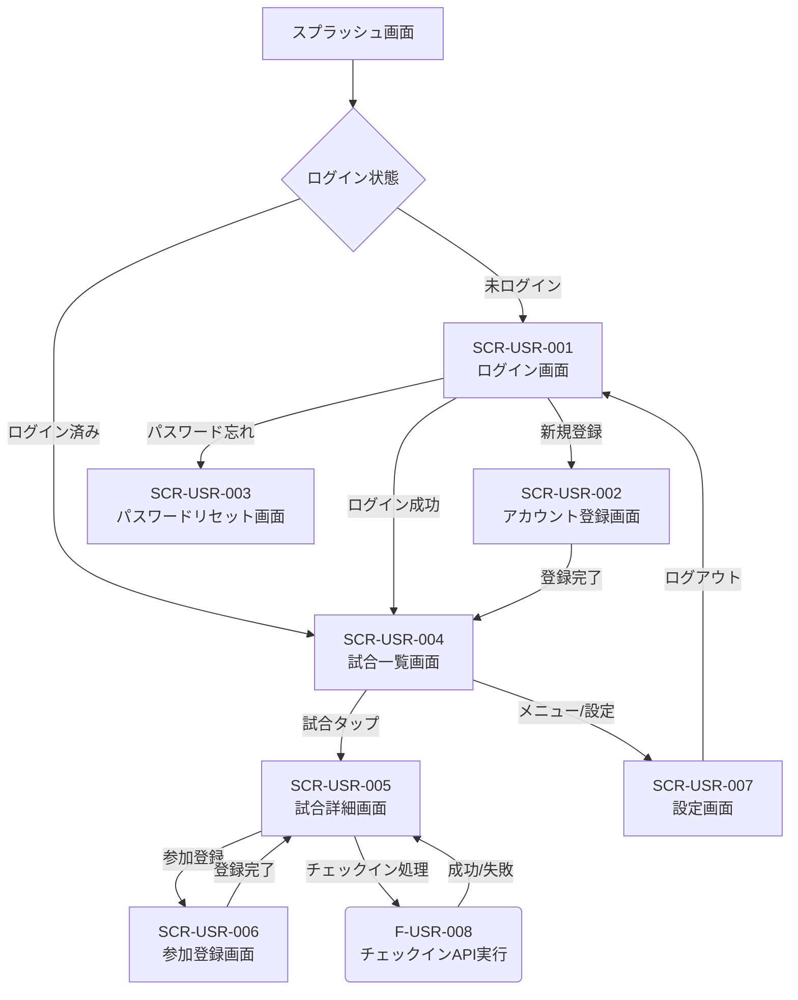
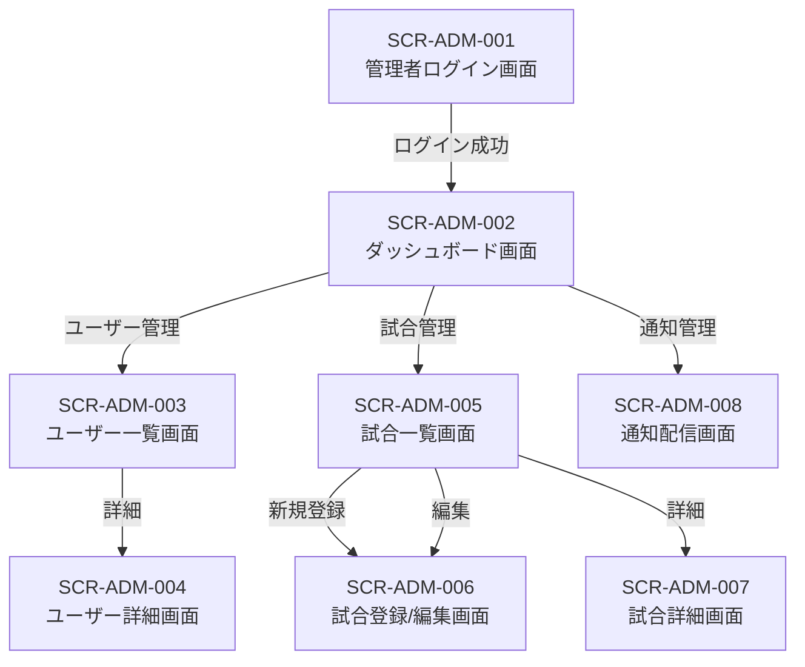

# 詳細設計書：草野球マッチングアプリ

## 第5章 API設計 (詳細定義)

基本設計書 第5章 の「詳細設計への共通コンテキスト」で指示されたタスク（API仕様書の完成、コントローラーの設計、FormRequestの設計）に基づき、全APIの仕様を以下の通り定義する。

---

### 5.1. API設計方針 (確定)

基本設計書に基づき、以下の方針を確定する。

- **アーキテクチャ**: RESTful API
- **命名規則**:
  - エンドポイント: リソース（名詞の複数形）ベース。バージョンプレフィックス `/api/v1` を付与。
  - JSONキー: スネークケース (例: `user_id`, `game_date_time`)。
- **バージョニング**: URL (`/v1`) で行う。

---

### 5.2. 認証・認可方式 (確定)

基本設計書に基づき、以下の方針を確定する。

- **認証方式**: Laravel Sanctum (Personal Access Token)。
- **トークン伝達**: `Authorization: Bearer {token}` ヘッダー。
- **トークンのライフタイム**: 24時間。
- **リフレッシュトークン**: 使用しない。期限切れ時はHTTP 401を返し、クライアントが再ログインする。
- **認可方式**: 管理者機能 (`/api/v1/admin/*`) は、`auth:sanctum` に加えて AdminMiddleware（第7章で実装）による権限チェックを行う。

---

### 5.3. APIエンドポイント一覧表 (確定)

基本設計書の定義に基づき、全APIエンドポイントを以下で確定する。

| エンドポイント | HTTPメソッド | 機能概要 | 認証要否 | 対応する機能ID |
|---|---|---|---|---|
| `/api/v1/auth/register` | POST | アカウント登録 | 不要 | F-USR-001 |
| `/api/v1/auth/login` | POST | ログイン | 不要 | F-USR-002 |
| `/api/v1/auth/logout` | POST | ログアウト | 必要 | F-USR-003 |
| `/api/v1/auth/password/reset` | POST | パスワードリセット要求 | 不要 | F-USR-004 |
| `/api/v1/auth/password/update` | PUT | パスワードリセット実行 | 不要 | F-USR-004 |
| `/api/v1/games` | GET | 試合一覧取得 (ユーザー用) | 必要 | F-USR-005 |
| `/api/v1/games/{gameId}` | GET | 試合詳細取得 (ユーザー用) | 必要 | F-USR-007 |
| `/api/v1/games` | POST | 試合登録 | 必要 (管理) | F-ADM-006 |
| `/api/v1/games/{gameId}` | PUT | 試合更新 | 必要 (管理) | F-ADM-007 |
| `/api/v1/games/{gameId}` | DELETE | 試合削除 | 必要 (管理) | F-ADM-008 |
| `/api/v1/games/{gameId}/participations` | POST | 試合参加登録 | 必要 | F-USR-006 |
| `/api/v1/games/{gameId}/checkin` | POST | チェックイン | 必要 | F-USR-008 |
| `/api/v1/admin/users` | GET | ユーザー一覧取得 (管理者用) | 必要 (管理) | F-ADM-001 |
| `/api/v1/admin/users/{userId}` | GET | ユーザー詳細取得 (管理者用) | 必要 (管理) | F-ADM-002 |
| `/api/v1/admin/users/{userId}` | DELETE | ユーザー強制退会 | 必要 (管理) | F-ADM-003 |
| `/api/v1/admin/games` | GET | 試合一覧取得 (管理者用) | 必要 (管理) | F-ADM-004 |
| `/api/v1/admin/games/{gameId}` | GET | 試合詳細取得 (管理者用) | 必要 (管理) | F-ADM-005 |
| `/api/v1/admin/notifications/push` | POST | プッシュ通知配信 | 必要 (管理) | F-ADM-009 |
| `/api/v1/admin/notifications/email` | POST | メール配信 | 必要 (管理) | F-ADM-010 |
| `/api/v1/device-tokens` | POST | デバイストークン登録 | 必要 | (FCM連携) |

---

### 5.4. リクエスト/レスポンス仕様 (全API定義)

基本設計書のテンプレートと固定フォーマットに基づき、全APIの仕様を定義する。

（指示: 以下に示す主要APIの例を参考に、上記5.3.の全APIについて仕様書を完成させること）

#### POST /api/v1/auth/login - F-USR-002

**概要**: ユーザーを認証し、トークンを発行する。

**認証**: 不要

**リクエストボディ**:

```json
{
  "email": "string(必須, email形式)",
  "password": "string(必須, 8-72文字)"
}
```

**レスポンス (200 OK)**:

```json
{
  "data": {
    "user": {
      "user_id": "c3e9c7f6-...",
      "email": "user@example.com",
      "nickname": "たろう"
    },
    "token": "1|abcdef..."
  },
  "meta": {
    "timestamp": "..."
  }
}
```

**主なエラー**: E-401-02 (認証失敗), E-422-04/05 (バリデーション)

---

#### GET /api/v1/games - F-USR-005

**概要**: ユーザー向けの試合一覧を取得する（ページネーション対応）。

**認証**: 必要

**クエリパラメータ**:

- `page`: integer (任意, デフォルト: 1)
- `per_page`: integer (任意, デフォルト: 20, 最大: 100)
- `prefecture`: string (任意, 都道府県名)
- `date_from`: string (任意, YYYY-MM-DD)
- `date_to`: string (任意, YYYY-MM-DD)

**レスポンス (200 OK)**: (固定フォーマット: リスト取得)

```json
{
  "data": [
    {
      "game_id": "c3e9c7f6-...",
      "place_name": "テスト球場",
      "game_date_time": "2025-11-01T14:00:00Z",
      "address": "東京都新宿区...",
      "prefecture": "東京都",
      "status": "募集中",
      "fee": 1000,
      "capacity": 18,
      "participant_count": 5
    }
  ],
  "meta": {
    "current_page": 1,
    "per_page": 20,
    "total": 100,
    "last_page": 5,
    "timestamp": "..."
  }
}
```

**主なエラー**: E-401-01 (未認証), E-400-03 (日付形式エラー)

---

#### POST /api/v1/games - F-ADM-006

**概要**: 管理者が新しい試合を登録する。

**認証**: 必要 (管理)

**リクエストボディ**: (第3章 F-ADM-006 の入力定義 参照)

```json
{
  "place_name": "string(必須, max:254)",
  "game_date_time": "string(必須, date, after: \"now +1 hour\")",
  "address": "string(必須, max:254)",
  "prefecture": "string(必須, 47都道府県のいずれか)",
  "latitude": "number(必須, -90~90)",
  "longitude": "number(必須, -180~180)",
  "acceptable_radius": "integer(必須, 1~1999)",
  "fee": "integer(任意, min:0)",
  "capacity": "integer(必須, min:18)"
}
```

**レスポンス (201 Created)**:

```json
{
  "data": {
    "game_id": "c3e9c7f6-...",
    "place_name": "...",
    // ... (登録された全フィールド)
  },
  "meta": {
    "timestamp": "..."
  }
}
```

**主なエラー**: E-401-01 (未認証), E-403-01 (管理者権限なし), E-422-01 (日時不正), E-422-03 (人数不正)

---

#### POST /api/v1/games/{gameId}/checkin - F-USR-008

**概要**: 試合へのチェックインを実行する。

**認証**: 必要

**リクエストボディ**: (第9章 のフローに基づく)

```json
{
  "latitude": "number(必須, -90~90)",
  "longitude": "number(必須, -180~180)"
}
```

**レスポンス (200 OK)**:

```json
{
  "data": {
    "status": "success",
    "participation_status": "チェックイン済"
  },
  "meta": {
    "timestamp": "..."
  }
}
```

**主なエラー**: E-400-08 (未参加), E-400-09 (時間外), E-400-10 (距離エラー), E-404-02 (試合なし), E-409-04 (重複)

---

### 5.5. エラーレスポンス統一仕様 (確定)

固定ルールに従い、全エラーレスポンスは以下のJSONフォーマットで確定する。

```json
{
  "error": {
    "code": "E-XXX-XX",
    "message": "エラーメッセージ",
    "details": [
      {
        "field": "email",
        "message": "メールアドレスの形式が正しくありません"
      }
    ]
  },
  "meta": {
    "timestamp": "2025-10-24T02:38:49Z"
  }
}
```

**`error.details`**: バリデーションエラー(422)の場合のみ、エラー内容を配列で格納する。

---

### 5.6. エラーコード完全一覧表 (確定)

エラーメッセージ定義書.csv の全項目を本詳細設計の仕様として確定する。

| エラーコード | HTTPステータス | メッセージ（日本語） | 発生条件 |
|---|---|---|---|
| E-400-01 | 400 | リクエストが不正です | JSON形式エラー・必須パラメータ欠落 |
| E-400-02 | 400 | ユーザーIDの形式が正しくありません | UUID形式でない |
| E-400-03 | 400 | 日付の形式が正しくありません | date_from/date_toが不正 |
| E-400-04 | 400 | 試合IDの形式が正しくありません | UUID形式でない |
| E-400-05 | 400 | 配信対象が見つかりません | 対象ユーザーが0件 |
| E-400-06 | 400 | パスワードリセットトークンが無効または期限切れです | トークンエラー |
| E-400-07 | 400 | この試合は参加登録できません | ステータスが募集中でない |
| E-400-08 | 400 | この試合に参加登録していません | 未参加 |
| E-400-09 | 400 | チェックイン可能時間外です | 時間外 (試合開始2時間前~終了時刻) |
| E-400-10 | 400 | 会場から{distance}メートル離れています | 位置エラー |
| E-401-01 | 401 | 認証に失敗しました | トークンが無効または期限切れ |
| E-401-02 | 401 | メールアドレスまたはパスワードが正しくありません | 認証失敗 |
| E-403-01 | 403 | 管理者権限が必要です | 管理者権限がない |
| E-404-01 | 404 | ユーザーが見つかりません | ユーザーが存在しない |
| E-404-02 | 404 | 試合が見つかりません | 試合が存在しない |
| E-409-01 | 409 | このメールアドレスは既に登録されています | メールアドレス重複 |
| E-409-02 | 409 | このニックネームは既に使用されています | ニックネーム重複 |
| E-409-03 | 409 | 既にこの試合に参加登録しています | 重複参加 |
| E-409-04 | 409 | 既にチェックイン済みです | 重複チェックイン |
| E-422-01 | 422 | 開催日時は現在時刻の1時間後以降を指定してください | game_date_timeが不正 |
| E-422-02 | 422 | 都道府県が正しくありません | prefectureが不正 (47都道府県のいずれか) |
| E-422-03 | 422 | 募集人数は18人以上を指定してください | capacityが18未満 |
| E-422-04 | 422 | メールアドレスの形式が正しくありません | email形式エラー |
| E-422-05 | 422 | パスワードは8文字以上72文字以下で入力してください | password長エラー |
| E-422-06 | 422 | パスワードは英大文字・英小文字・数字のうち2種類以上を含めてください | password強度エラー |
| E-422-07 | 422 | ニックネームは4文字で入力してください | nickname長エラー |
| E-422-08 | 422 | パスワード確認が一致しません | password不一致 |
| E-422-09 | 422 | チーム区分が正しくありません | 'チームA' or 'チームB' |
| E-422-10 | 422 | ポジションが正しくありません | 9ポジションのいずれか |
| E-500-01 | 500 | 通知の配信に失敗しました | FCMエラー |
| E-500-02 | 500 | メールの配信に失敗しました | SMTPエラー |
| E-500-03 | 500 | サーバーエラーが発生しました | 予期しないエラー |

---

### 5.7. コード生成AIへの共通コンテキスト (第5章)

**目的**:

第5章のAPI定義に基づき、Laravelのルーティング、全コントローラーのメソッド、全FormRequestのバリデーションルールを実装する。

**指示**:

**ルーティングの実装 (routes/api.php)**:

- 「5.3. APIエンドポイント一覧表」に基づき、`routes/api.php` に全APIのルートを定義してください。
- 認証が「必要」なルートは `middleware(['auth:sanctum'])` グループ内に入れてください。
- 認証が「必要 (管理)」なルートは `middleware(['auth:sanctum', 'admin'])` グループ（'admin' は第7章で作成するミドルウェア）内に入れ、`prefix('admin')` を付けてください。
- 例: `Route::get('/games', [GameController::class, 'index'])->middleware('auth:sanctum');`
- 例: `Route::post('/games', [GameController::class, 'store'])->middleware(['auth:sanctum', 'admin']);`

**コントローラーの実装 (app/Http/Controllers/)**:

- 各コントローラー（GameController, AuthController など）に、「5.3.」の全エンドポイントに対応するメソッド（index, show, store, update, destroy など）を作成してください。
- メソッドの引数には、対応する FormRequest（例: StoreGameRequest $request）を型宣言し、バリデーションが自動実行されるようにしてください。
- メソッドの本体（ロジック）は、try-catch ブロックで囲み、第2章で注入した Service クラスのメソッドを呼び出すだけにしてください。
- 成功時は、GameResource などを使い、固定フォーマットに従って `data` と `meta` を含むJSONを返却してください。
- Service から例外（CustomException など）がスローされた場合は、Handler.php（第12章で実装）でキャッチし、「5.5. エラーレスポンス統一仕様」のJSONを返却してください。

**FormRequestの実装 (app/Http/Requests/)**:

- 「5.4.」でリクエストボディが定義されている全API（register, login, storeGame, checkin など）に対応する FormRequest クラス（RegisterRequest.php など）を作成してください。
- `authorize` メソッドは `true` を返してください（認可は AdminMiddleware で行う）。
- `rules` メソッドに、「5.4.」のリクエストボディ定義と「5.6. エラーコード一覧表」のバリデーションルール（required, email, min, max, unique, after, in など）を **すべて** 実装してください。
- `messages` メソッドで、E-422-XX に対応する日本語エラーメッセージを **すべて** 定義してください。

---

## 第6章 画面設計 (詳細定義)

基本設計書 第6章 の「詳細設計への共通コンテキスト」で指示されたタスク（全画面の設計書完成、ワイヤーフレーム作成、状態管理の設計）に基づき、全画面の仕様を以下の通り定義する。

デザインは 画面ワイヤーフレームテンプレート.md のガイドライン（カラー、タイポグラフィ、スペーシング）に厳密に従うこと。

---

### 6.1. 画面一覧表 (確定)

基本設計書に基づき、全15画面（ユーザー向け7, 管理者向け8）を確定する。

| 画面ID | 画面名 | 画面概要 | 対応する機能ID |
|---|---|---|---|
| **ユーザー向け (Flutter)** |  |  |  |
| SCR-USR-001 | ログイン画面 | ログインする | F-USR-002 |
| SCR-USR-002 | アカウント登録画面 | 新規アカウントを登録する | F-USR-001 |
| SCR-USR-003 | パスワードリセット画面 | パスワードの再設定 | F-USR-004 |
| SCR-USR-004 | 試合一覧画面 | 試合を一覧表示・検索する | F-USR-005 |
| SCR-USR-005 | 試合詳細画面 | 試合の詳細情報を表示する | F-USR-007 |
| SCR-USR-006 | 参加登録画面 | 試合への参加登録を行う | F-USR-006 |
| SCR-USR-007 | 設定画面 | ログアウトなどを行う | F-USR-003 |
| **管理者向け (Web)** |  |  |  |
| SCR-ADM-001 | 管理者ログイン画面 | 管理者がログインする | (F-USR-002相当) |
| SCR-ADM-002 | ダッシュボード画面 | 統計情報や最近の試合を表示 |  |
| SCR-ADM-003 | ユーザー一覧画面 | 登録ユーザーを一覧表示 | F-ADM-001 |
| SCR-ADM-004 | ユーザー詳細画面 | ユーザーの詳細情報を表示 | F-ADM-002, F-ADM-003 |
| SCR-ADM-005 | 試合一覧画面(管理者用) | 全ての試合を一覧表示 | F-ADM-004 |
| SCR-ADM-006 | 試合登録/編集画面 | 試合の新規登録または更新 | F-ADM-006, F-ADM-007 |
| SCR-ADM-007 | 試合詳細画面(管理者用) | 試合の詳細情報を表示 | F-ADM-005 |
| SCR-ADM-008 | 通知配信画面 | プッシュ通知やメールを配信 | F-ADM-009, F-ADM-010 |

---

### 6.2. 画面遷移図 (確定)

基本設計書に記載のMermaid図を本詳細設計の仕様として確定する。

#### 1. ユーザー向け画面遷移



#### 2. 管理者向け画面遷移



---

### 6.3. 各画面の詳細設計 (全画面定義)

基本設計書のテンプレートに基づき、全画面の仕様を定義する。

（指示: 以下に示す主要画面の例を参考に、上記6.1.の全15画面について設計書を完成させること）

#### SCR-USR-004: 試合一覧画面 (Flutter)

**対応機能ID**: F-USR-005

**ワイヤーフレーム**: (画面ワイヤーフレームテンプレート.md 参照)

```
┌─────────────────────────────────┐
│ 試合一覧      🔍 ⚙️              │ ← AppBar (フィルター・設定アイコン)
├─────────────────────────────────┤
│ ┌─────────────────────────────┐ │
│ │ 📍 東京都 ▼    📅 日付指定    │ │ ← フィルターチップ (タップでダイアログ)
│ └─────────────────────────────┘ │
│                                 │
│ ┌─────────────────────────────┐ │ ← GameCard (タップで SCR-USR-005)
│ │ 東京ドーム           [募集中]  │ │
│ │ 📅 2025/10/30 14:00          │ │
│ │ 📍 東京都文京区...           │ │
│ │ 💰 ¥1,000     👥 12/18人     │ │
│ └─────────────────────────────┘ │
│                                 │
│ (ListView.builder)              │
│ (Scroll to bottomで次ページ読込) │
└─────────────────────────────────┘
```

**画面項目定義 (表形式)**

| 項目名 | Widget型 | イベント | 備考 |
|---|---|---|---|
| 設定アイコン | IconButton | onPressed | SCR-USR-007 へ Navigator.push |
| フィルター(都道府県) | Chip / TextButton | onPressed | 都道府県選択ダイアログを表示 |
| 試合カード | Card (InkWell) | onTap | SCR-USR-005 へ Navigator.push(gameId) |
| 試合リスト | ListView.builder | ScrollNotification | 末尾までスクロールしたら gameListProvider.notifier.fetchNextPage() を呼び出す |

**状態管理 (Riverpod)**

- **gameListProvider (AsyncNotifierProvider)**: 試合一覧（List<Game>）の状態 (AsyncValue) を管理。
  - state: AsyncLoading（初回ロード中）, AsyncData（表示）, AsyncError（エラー表示）。
  - fetchNextPage(): 次のページを GET `/api/v1/games?page=X` で非同期取得し、state のリストに追加。
  - applyFilter(prefecture, date): フィルター条件を更新し、state を AsyncLoading にして page=1 から再取得。
- **gameListFilterProvider (StateProvider)**: 現在のフィルター条件（都道府県、日付）を保持。

**操作フロー**

1. 画面表示時、gameListProvider が F-USR-005 (GET `/api/v1/games?page=1`) を呼び出す。
2. gameListProvider の状態が AsyncLoading になり、画面中央に CircularProgressIndicator を表示。
3. API成功時、AsyncData になり、ListView.builder で GameCard を描画。
4. ユーザーがリストを末尾までスクロールする。
5. ScrollNotification を検知し、gameListProvider.notifier.fetchNextPage() を呼び出す。
6. state が AsyncLoading ではない場合、GET `/api/v1/games?page=2` を呼び出し、リストの末尾に GameCard を追加描画。
7. (フィルター操作) ユーザーが [📍 東京都] チップをタップ。
8. ダイアログで gameListFilterProvider の状態を更新。
9. gameListProvider がフィルターの変更を検知し、applyFilter() を実行。
10. GET `/api/v1/games?page=1&prefecture=...` を呼び出し、リスト全体を更新。

**エラー表示 (固定ルール)**

- **AsyncError 時**: gameListProvider が AsyncError 状態の場合、リストの代わりにエラーメッセージ（E-500-03 など）と「リトライ」ボタンを表示する。

---

#### SCR-ADM-006: 試合登録/編集画面 (Web)

**対応機能ID**: F-ADM-006 (登録), F-ADM-007 (更新)

**ワイヤーフレーム**: (Webフォーム)

```
┌──────────────────────────────────────────┐
│ 試合登録                                   │ ← H1
├──────────────────────────────────────────┤
│ 場所名*                                    │
│ [ テスト球場                             ] │ ← Input (text)
│                                          │
│ 開催日時*                                  │
│ [ 2025-11-01T14:00                       ] │ ← Input (datetime-local)
│                                          │
│ 住所*                                      │
│ [ 東京都...                             ] │ ← Input (text)
│                                          │
│ 都道府県*     緯度*       経度*            │
│ [ 東京都 ▼ ] [ 35.689... ] [ 139.691... ] │ ← Select, Input(number)
│                                          │
│ 許容半径(m)*  募集人数*   参加費(円)       │
│ [ 500        ] [ 18         ] [ 1000       ] │ ← Input(number)
│                                          │
│ ──────────────────────────────────────── │
│ [ 登録する ]                               │ ← Button (submit)
└──────────────────────────────────────────┘
```

**画面項目定義 (表形式)**

| 項目名 | HTML要素 | 必須/任意 | バリデーション (API: E-422-XX) |
|---|---|---|---|
| 場所名 | input[type=text] | 必須 | 必須, max:254 |
| 開催日時 | input[type=datetime-local] | 必須 | 必須, 1時間後以降 (E-422-01) |
| 住所 | input[type=text] | 必須 | 必須, max:254 |
| 都道府県 | select | 必須 | 必須, 47都道府県 (E-422-02) |
| 緯度 | input[type=number] | 必須 | 必須, -90~90 |
| 経度 | input[type=number] | 必須 | 必須, -180~180 |
| 許容半径 | input[type=number] | 必須 | 必須, 1~1999 |
| 募集人数 | input[type=number] | 必須 | 必須, min:18 (E-422-03) |
| 参加費 | input[type=number] | 任意 | 任意, min:0 |

**状態管理 (Web)**

(React/Vue.jsを想定) useState または ref で各フォーム項目の値を管理。errorState でAPIから返却されたバリデーションエラー（error.details）を保持。

**操作フロー**

1. (編集時) 画面ロード時、F-ADM-005 (GET `/api/v1/admin/games/{id}`) を呼び出し、フォームの初期値をセット。
2. 管理者が全必須項目を入力する。
3. [登録する] ボタンをクリック。
4. (登録時) F-ADM-006 (POST `/api/v1/games`) をリクエストボディと共に呼び出す。
5. (編集時) F-ADM-007 (PUT `/api/v1/games/{id}`) を呼び出す。
6. (成功時: 200/201) SCR-ADM-005 (試合一覧) に遷移し、「登録/更新しました」トーストを表示。
7. (失敗時: 422) APIから返却された error.details を errorState にセット。
8. 各入力フォームの下にインラインエラー（例: E-422-03: 募集人数は18人以上を指定してください）を表示。
9. (失敗時: 401/403/500) 全体エラーとしてダイアログまたはトースト（E-403-01 など）を表示。

**エラー表示 (固定ルール)**

- **トースト**: 成功時、権限エラー時 (E-403-01)
- **インラインエラー**: バリデーションエラー時 (E-422-XX)

---

### 6.4. コード生成AIへの共通コンテキスト (第6章)

**目的**:

第6章の画面設計に基づき、Flutterの全画面 (Widget) と状態管理 (Riverpod Provider) を実装する。

**指示**:

**デザインガイドラインの遵守**:

- 画面ワイヤーフレームテンプレート.md に記載されているカラーパレット（#4CAF50 など）、タイポグラフィ（24pt Bold など）、スペーシング（8px 単位）を **厳密に** 遵守して Flutter Widget を構築してください。
- 共通コンポーネント（GameCard, PrimaryButton）は `lib/shared/widgets/` 配下に作成し、再利用してください。

**画面クラスの生成 (Flutter)**:

- 「6.1. 画面一覧表」のユーザー向け全7画面（LoginScreen.dart, GameListScreen.dart など）を `lib/features/*/presentation/` 配下に ConsumerWidget または ConsumerStatefulWidget として作成してください。

**状態管理Providerの定義 (Flutter)**:

- 「6.3. 状態管理 (Riverpod)」の定義に基づき、authProvider, gameListProvider, gameDetailProvider などの AsyncNotifierProvider を `lib/features/*/application/` 配下に作成してください。
- Provider の build メソッド内では、第2章で定義した Repository クラス（`ref.read(gameRepositoryProvider)` など）を呼び出して、API（第5章）からデータを取得してください。

**UIとロジックの接続 (Flutter)**:

- Screen (Widget) 側では `ref.watch()` を使用して Provider の状態 (AsyncValue) を監視してください。
- AsyncLoading の場合は CircularProgressIndicator を表示してください。
- AsyncError の場合は「6.3. エラー表示」の定義（トースト、ダイアログ、インライン）に従ってエラーを表示してください。
- AsyncData の場合は、取得したデータ（List<Game> など）を使って ListView などのWidgetを描画してください。
- ボタンの onPressed イベントでは、`ref.read(Provider.notifier).method()`（例: `ref.read(authProvider.notifier).login()`）を呼び出し、ロジックを実行してください。

**ナビゲーションの実装 (Flutter)**:

- 「6.2. 画面遷移図」に基づき、Navigator.push や Navigator.pop を使用して画面間の遷移を実装してください。
- 認証が必要な画面（GameListScreen）は、スプラッシュ画面（main.dart）で authProvider の状態を監視し、未ログインなら LoginScreen にリダイレクトしてください。
