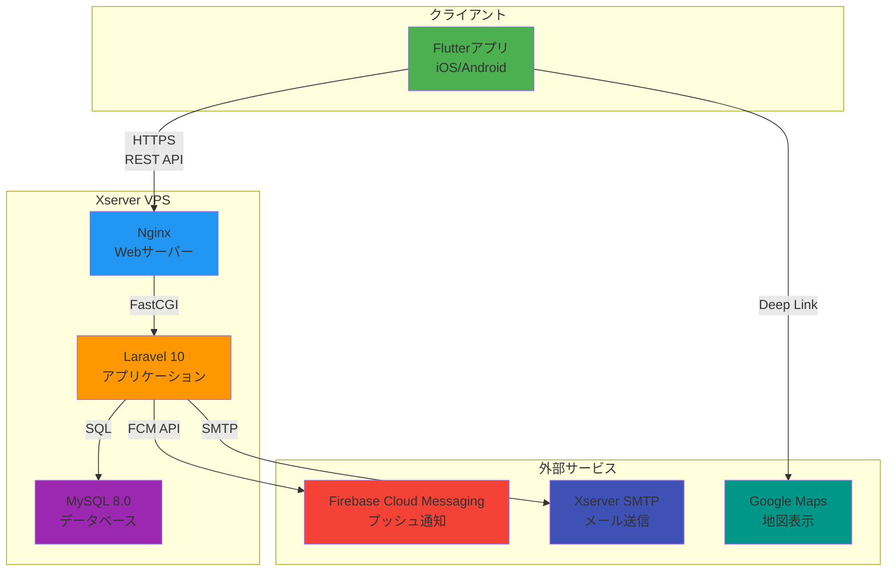

# 基本設計書：草野球マッチングアプリ

## 第1章 システム概要

### 1.1. システムの目的

本システムは、草野球の試合を主催（募集）したい個人と、試合に参加したい個人をマッチングさせるためのプラットフォームを提供する。

主な目的は以下の通りである。

- 試合開催者が容易に参加者を募集できるようにする。
- 参加希望者が自分の希望する日時や場所で試合を見つけ、気軽に参加登録できるようにする。
- 試合当日のチェックイン機能を提供し、参加管理を円滑化する。
- 管理者向け機能を提供し、ユーザーと試合の健全な運用管理を可能にする。

---

### 1.2. システム全体構成図



---

### 1.3. 技術スタック一覧

| 領域 | 技術 | バージョン/詳細 | 備考 |
|---|---|---|---|
| フロントエンド | Flutter | 3.16 (要件定義書に基づく) | iOS / Android |
| 状態管理 (Flutter) | Riverpod | 2.x | 固定ルール |
| トークン保存 (Flutter) | flutter_secure_storage |  | 固定ルール |
| 位置情報 (Flutter) | geolocator |  | 固定ルール |
| バックエンド | Laravel | 10 |  |
| Webサーバー | Nginx |  | Xserver VPS |
| データベース | MySQL | 8.0 | Xserver VPS |
| 認証 (Laravel) | Laravel Sanctum | Personal Access Token | 固定ルール |
| プッシュ通知 | Firebase Cloud Messaging |  | 外部連携 |
| メール送信 | Xserver SMTP |  | 外部連携 |
| 地図連携 | Google Maps | ディープリンク | 外部連携 |

---

### 1.4. 開発環境・本番環境の構成

| 項目 | 開発環境 | 本番環境 | 備考 |
|---|---|---|---|
| サーバー | ローカル (Docker, Laravel Sail等) | Xserver VPS |  |
| Webサーバー | Nginx (Docker) | Nginx |  |
| APサーバー | PHP (Docker) | PHP (Xserver) |  |
| DBサーバー | MySQL (Docker) | MySQL 8.0 |  |
| ドメイン | localhost / 127.0.0.1 | yourdomain.com (想定) |  |
| SSL |  | 必須 |  |
| .env | APP_ENV=local<br>APP_DEBUG=true | APP_ENV=production<br>APP_DEBUG=false |  |

---

## 詳細設計への共通コンテキスト（第1章）

### 後続タスク（詳細設計）への指示:

**システム構成図の活用:**

システム構成図にある通り、クライアント（Flutter）とサーバー（Laravel）はHTTPS (REST API) で完全に分離されています。

詳細設計（シーキンス図など）を作成する際は、必ずこのAPI境界を意識してください。

外部サービス（FCM, SMTP, Google Maps）との連携は、必ずサーバーサイド（FCM, SMTP）またはクライアントサイド（Google Maps）のどちらで実行されるかを構成図に基づき明確に区別してください。

**技術スタックの固定:**

技術スタックは固定です。これ以外のライブラリやフレームワークの導入は原則禁止とします。

---

## 第2章 アーキテクチャ設計

### 2.1. レイヤー構成

本システムのアーキテクチャは、要件定義書の固定ルールに基づき、以下のパターンを採用する。

#### バックエンド (Laravel)

**Layered Architecture（レイヤードアーキテクチャ）**を採用する。

これはLaravel標準のMVCパターンを拡張し、責務を明確に分離したものである。

- **Controller**: HTTPリクエストの受付、リクエストの検証（FormRequest）、レスポンスの返却。ビジネスロジックは保持しない。
- **Service**: ビジネスロジックの集約。複数のRepositoryを呼び出し、トランザクション管理を行う責務を持つ。
- **Repository**: データアクセス層。Eloquentモデルをラップし、データベースとの具体的なやり取り（CRUD）を行う。ControllerやServiceはEloquentに直接依存せず、Repositoryを介してデータ操作を行う。
- **Model**: Eloquentモデル。データベーステーブルとのマッピング、リレーション定義。
- **Request**: フォームリクエストバリデーション。
- **Resource**: APIレスポンスのJSON構造を定義。

#### フロントエンド (Flutter)

**Layered Architecture（レイヤードアーキテクチャ）**を採用し、責務を分離する。

- **Presentation Layer (UI)**: 画面の描画（Widget）、ユーザー操作の受付。状態（State）に応じてUIを構築する。
- **Application Layer (State Management)**: 状態管理。Riverpod 2.x を使用し、UIからのイベントを受けてビジネスロジック（UseCase）を呼び出し、状態を更新してUIに通知する。
- **Domain Layer (Business Logic)**: ドメインモデル、ビジネスロジック（UseCase / Service）。
- **Data Layer (Repository)**: データアクセス層。API（サーバー）やローカルストレージ（flutter_secure_storage）との通信を抽象化する。

---

### 2.2. ディレクトリ構造

固定ルールに従い、以下のディレクトリ構造を採用する。

#### バックエンド (Laravel)

```
app/
  ├── Console/
  │   └── Commands/       # バッチ処理 (例: UpdateGameStatus.php)
  ├── Exceptions/         # 例外処理
  ├── Http/
  │   ├── Controllers/    # APIコントローラー (例: GameController.php)
  │   ├── Middleware/
  │   └── Requests/       # バリデーション (例: CreateGameRequest.php)
  ├── Models/             # Eloquentモデル (例: User.php, Game.php)
  ├── Providers/
  ├── Repositories/       # リポジトリ層 (例: GameRepository.php)
  └── Services/           # サービス層 (例: GameService.php)
routes/
  └── api.php             # APIエンドポイント定義
```

#### フロントエンド (Flutter)

```
lib/
  ├── core/               # アプリ共通の基盤
  │   ├── providers/      # 共通Provider (例: api_client_provider.dart)
  │   ├── models/         # データモデル (例: user.dart, game.dart)
  │   └── services/       # 共通サービス (例: fcm_service.dart, api_client.dart)
  ├── features/           # 機能ごと（ドメインごと）のディレクトリ
  │   ├── auth/           # 認証機能
  │   │   ├── presentation/ # 画面 (例: login_screen.dart)
  │   │   ├── application/  # 状態管理 (例: auth_provider.dart)
  │   │   └── data/         # リポジトリ (例: auth_repository.dart)
  │   ├── game/           # 試合機能
  │   │   ├── presentation/ # (例: game_list_screen.dart)
  │   │   ├── application/
  │   │   └── data/
  │   └── checkin/        # チェックイン機能
  │       ├── presentation/
  │       ├── application/
  │       └── data/
  └── shared/             # アプリ全体で共有されるWidgetやUtil
      ├── widgets/        # 共通コンポーネント (例: primary_button.dart)
      └── utils/          # ユーティリティ (例: distance_calculator.dart)
main.dart                 # アプリケーション起動、Firebase初期化
```

---

### 2.3. 通信方式

- **プロトコル**: HTTPS (TLS 1.2以上)
- **形式**: REST API
- **データフォーマット**: JSON

#### 認証フロー

1. クライアントが **ログインAPI** (`/api/v1/auth/login`) にメールアドレスとパスワードを送信。
2. サーバー (Laravel Sanctum) は認証成功後、**Personal Access Token (PAT)** を発行し、クライアントに返却。
3. クライアント (Flutter) は受け取ったトークンを `flutter_secure_storage` を使用してデバイスの安全な領域（Keychain/EncryptedSharedPreferences）に保存する。
4. 以降、認証が必須なAPIへのリクエスト時は、HTTPヘッダーの `Authorization` に `Bearer {token}` を付与して送信する。
5. トークンの有効期限は **24時間** とする。リフレッシュトークンは使用しない。
6. 有効期限が切れた場合は、エラーコード (401) を返し、クライアント側で再ログイン（ログイン画面へ遷移）を要求する。

---

### 2.4. 状態管理方式 (Flutter)

**採用技術**: Riverpod 2.x （固定ルール）

#### Providerの使い分け

- **Provider**: 変更不可能な依存性（RepositoryやServiceなど）の注入に使用する。
- **FutureProvider**: APIからのデータ取得など、非同期の読み取り専用データの管理に使用する。（例：試合詳細取得）
- **NotifierProvider / AsyncNotifierProvider**: ユーザー操作によって状態が変更されるデータの管理に使用する。（例：ログイン状態、フォーム入力、試合一覧（フィルターやページネーション））

**責務**: 状態管理ロジック（Notifier）は、Data層（Repository）を呼び出し、取得したデータを状態（State）としてUI（Widget）に公開する。UI側は `ref.watch` や `ref.read` を介して状態を参照・操作する。

---

### 2.5. 依存関係図

（依存関係の方向性を示す）

#### バックエンド (Laravel)

```
Controller → Service → Repository → Model (Eloquent)
```

上位レイヤー（Controller）は、下位レイヤー（Service）にのみ依存する。

Repository が Model に依存し、DBとの具体的なやり取りをカプセル化する。

#### フロントエンド (Flutter)

```
Presentation (UI) → Application (State) → Data (Repository)
```

UIは状態管理（Provider）に依存する。

状態管理（Provider）はデータ層（Repository）に依存する。

データ層（Repository）が外部（APIやローカルストレージ）との通信を担当する。

---

## 詳細設計への共通コンテキスト（第2章）

### 後続タスク（詳細設計）への指示:

**クラス設計:**

**Laravel側**: 「2.2. ディレクトリ構造」に従い、機能ごとにController, Service, Repositoryクラスを作成してください。

例えば、試合管理機能（F-ADM-004～008, F-USR-005～008）であれば、GameController, GameService, GameRepositoryが対応します。

**Flutter側**: 「2.2. ディレクトリ構造」のFeature-First構造に従い、auth, game, checkin などの機能単位で presentation, application, data の各クラスを設計・配置してください。

**シーケンス図:**

「2.3. 通信方式」で定義した認証フローや、各APIの処理フローについてシーケンス図を作成する際、必ず「2.1. レイヤー構成」で定義した責務（Controller, Service, Repository）を登場させ、その依存関係の方向性を遵守してください。

**状態管理設計（Flutter）:**

「2.4. 状態管理方式」に基づき、各画面で必要となる状態（例：ローディング中、エラー発生、データ一覧）を定義し、それを管理するための NotifierProvider または FutureProvider を具体的に設計してください。
