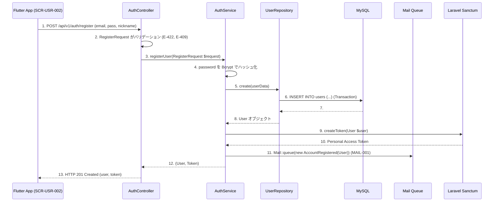
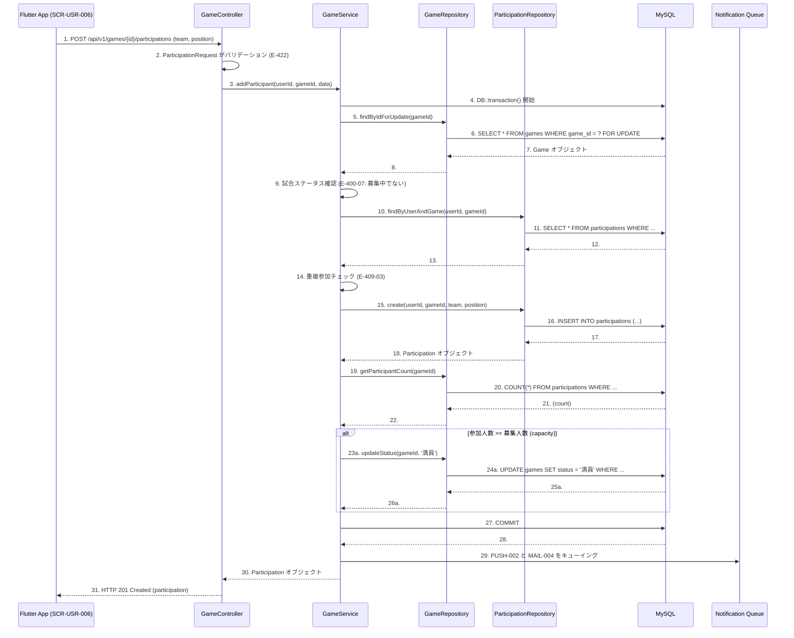

# 詳細設計書：草野球マッチングアプリ

## 第3章 機能定義 (詳細定義)

基本設計書 第3章 の「詳細設計への共通コンテキスト」で指示されたタスク（シーケンス図の作成、全機能定義の完成）に基づき、主要な機能のシーケンス図と、全18機能の定義（具体例）を以下の通り定義する。

### 3.1 主要機能シーケンス図

#### 1. F-USR-001: アカウント登録



#### 2. F-USR-006: 試合参加登録



### 3.2 全18機能の詳細定義 (具体例)

基本設計書 第3章 のテンプレートに基づき、全18機能の定義を完成させる。以下に主要な機能の具体例を記載する。

（指示: 残りの機能についても、このフォーマットに従いすべて定義すること）

#### 1. F-USR-006: 試合参加登録機能

| 項目 | 内容 |
|---|---|
| 機能ID | F-USR-006 |
| 機能名 | 試合参加登録機能 |
| ユーザーストーリー | 利用者 として、参加したい試合を見つけた時に、チームとポジションを選んで参加登録したい。 |
| 概要 | ユーザーが特定の試合に対し、参加するチーム（A/B）と希望ポジション（9種）を選択して参加を確定する。 |

**前提条件:**

- ユーザーがログイン済みである（認証トークン必須）
- 対象の試合 (gameId) が存在する
- 対象の試合のステータスが `募集中` である

**事後状態 (成功時):**

- `participations` テーブルに新しいレコードが1件追加される
- 該当の `gameId` の参加人数が `capacity`（募集人数）に達した場合、`games` テーブルの `status` が `満員` に更新される
- 「試合参加登録完了」プッシュ通知（PUSH-002）が送信される
- 「試合参加登録完了」メール（MAIL-004）が送信される

**入力 (インプット)**

APIリクエスト: `POST /api/v1/games/{gameId}/participations`

| 項目名 | 型 | 必須 | バリデーションルール (固定) |
|---|---|---|---|
| team_division | string | 必須 | 'チームA' または 'チームB' (E-422-09) |
| position | string | 必須 | '投手', '捕手' ... '右翼手' (9種) (E-422-10) |

**処理フロー**

(上記 3.1. のシーケンス図 参照)

i. APIコントローラーがリクエストを受領
ii. FormRequestが入力値（team_division, position）のバリデーションを実行 (E-422)
iii. GameService の `addParticipant` メソッドを呼び出す
iv. トランザクション開始
v. GameRepository で対象の `gameId` を `FOR UPDATE` でロックし取得
vi. (準正常系) 試合が存在しない場合 (E-404-02)、ロールバックして404を返す
vii. (準正常系) 試合の `status` が `募集中` でない場合 (E-400-07)、ロールバックして400を返す
viii. ParticipationRepository で、ユーザーが既にこの試合に参加済みか確認する (E-409-03)
ix. ParticipationRepository が `participations` テーブルにINSERTする
x. GameRepository で、現在の参加人数をカウントし、`capacity` に達したか判定する
xi. (分岐) 達した場合、`games` テーブルの `status` を `満員` にUPDATEする
xii. トランザクションコミット
xiii. NotificationService がPUSH-002とMAIL-004をキューに追加する
xiv. コントローラーが成功レスポンス（201）を返却する

**出力 (アウトプット)**

APIレスポンス (201 Created):

```json
{
  "data": {
    "participation_id": "...",
    "user_id": "...",
    "game_id": "...",
    "team_division": "チームA",
    "position": "投手",
    "status": "参加確定"
  },
  "meta": {
    "timestamp": "..."
  }
}
```

**エラー処理**

| エラーコード | HTTPステータス | メッセージ | 発生条件 |
|---|---|---|---|
| E-400-07 | 400 | この試合は参加登録できません | ステータスが `募集中` でない |
| E-401-01 | 401 | 認証に失敗しました | 未ログイン |
| E-404-02 | 404 | 試合が見つかりません | gameIdが存在しない |
| E-409-03 | 409 | 既にこの試合に参加登録しています | 重複参加 |
| E-422-09 | 422 | チーム区分が正しくありません | 'チームA'/'チームB' 以外 |
| E-422-10 | 422 | ポジションが正しくありません | 9ポジション以外 |
| E-500-03 | 500 | サーバーエラーが発生しました | DB障害など |

#### 2. F-ADM-006: 試合登録機能

| 項目 | 内容 |
|---|---|
| 機能ID | F-ADM-006 |
| 機能名 | 試合登録機能 |
| ユーザーストーリー | 管理者 として、新しい試合を企画した時に、システムに試合情報を登録したい。 |
| 概要 | 管理者が試合の日時、場所、募集人数などの詳細情報を入力し、新しい試合を作成する。 |

**前提条件:**

- 管理者がログイン済みである（認証トークン＋管理者権限必須）

**事後状態 (成功時):**

- `games` テーブルに新しい試合レコードが1件追加される
- 「試合登録完了」プッシュ通知（PUSH-001）が登録した管理者に送信される

**入力 (インプット)**

APIリクエスト: `POST /api/v1/games`

| 項目名 | 型 | 必須 | バリデーションルール (固定) |
|---|---|---|---|
| place_name | string | 必須 | 最大長: 254文字 |
| game_date_time | string | 必須 | 未来の日時 (現在時刻の1時間後以降) (E-422-01) |
| address | string | 必須 | 最大長: 254文字 |
| prefecture | string | 必須 | 47都道府県のいずれか (E-422-02) |
| latitude | number | 必須 | 範囲: -90 ~ 90 |
| longitude | number | 必須 | 範囲: -180 ~ 180 |
| acceptable_radius | integer | 必須 | 範囲: 1 ~ 1999 (メートル) |
| fee | integer | 任意 | 0以上の整数 (NULL可) |
| capacity | integer | 必須 | 最小値: 18 (E-422-03) |

**処理フロー**

i. APIコントローラーがリクエストを受領
ii. StoreGameRequest が入力値のバリデーションを実行 (E-422)
iii. AdminMiddleware が管理者権限をチェック (E-403-01)
iv. GameService の `createGame` メソッドを呼び出す
v. トランザクション開始
vi. GameRepository が `games` テーブルにINSERTする
vii. トランザクションコミット
viii. NotificationService がPUSH-001をキューに追加する
ix. コントローラーが成功レスポンス（201）を返却する

**出力 (アウトプット)**

APIレスポンス (201 Created):

```json
{
  "data": {
    "game_id": "...",
    "place_name": "テスト球場",
    "game_date_time": "...",
    "status": "募集中",
    "capacity": 18
    // ... 他の全フィールド
  },
  "meta": {
    "timestamp": "..."
  }
}
```

**エラー処理**

| エラーコード | HTTPステータス | メッセージ | 発生条件 |
|---|---|---|---|
| E-401-01 | 401 | 認証に失敗しました | 未ログイン |
| E-403-01 | 403 | 管理者権限が必要です | 一般ユーザーによる実行 |
| E-422-01 | 422 | 開催日時は現在時刻の1時間後以降を指定してください | 日時が過去または直近すぎる |
| E-422-03 | 422 | 募集人数は18人以上を指定してください | capacity < 18 |
| E-500-03 | 500 | サーバーエラーが発生しました | DB障害など |

### 3.3 コード生成AIへの共通コンテキスト (第3章)

**目的:**

第3章のシーケンス図と機能定義に基づき、Service層の具体的なビジネスロジックと、FormRequestのバリデーションルールを実装する。

**指示:**

#### シーケンス図の実装 (F-USR-006):

「3.1. のシーケンス図 (F-USR-006)」に基づき、GameService に `addParticipant` メソッドを実装してください。

**トランザクションとロック:**

- 処理フロー (4)~(28) は、必ず `DB::transaction()` ブロック内で実行してください
- 処理フロー (5) の試合情報取得時は、デッドロック（競合）を防ぐため `->lockForUpdate()` を付けてください

**ロジックの順序:**

- 必ず (9) status チェック、(14) 重複参加 チェック を (16) INSERT 処理の **前** に実行してください

**ステータス更新:**

- 処理フロー (19)~(26a) の「満員ステータスへの自動更新ロジック」を必ず実装してください

**非同期通知:**

- 処理フロー (29) の通知・メール送信は、トランザクションがコミットされた **後** に、`Notification::queue()` や `Mail::queue()` を使って非同期で実行してください

#### FormRequestの実装 (F-ADM-006):

`app/Http/Requests/StoreGameRequest.php` を作成してください。

- `authorize` メソッドは `true` を返すようにしてください（権限チェックは AdminMiddleware で行うため）
- `rules` メソッドに、「3.2. 機能定義 (F-ADM-006)」の「入力」セクションで定義されたバリデーションルール（place_name, game_date_time (date, after: "now +1 hour"), capacity (integer, min:18) など）をすべて実装してください
- `messages` メソッドで、対応するエラーコード（E-422-01, E-422-03）に基づいた日本語エラーメッセージを定義してください

#### 全機能の実装:

この詳細設計書（3.2）のテンプレートを参考に、基本設計書に存在する残りの全16機能（F-ADM-001~, F-USR-001~）の「処理フロー」と「エラー処理」を具体的に定義し、それに基づいた Service クラスのメソッドと FormRequest クラスを実装してください。

---

## 第4章 データベース設計 (詳細定義)

基本設計書 第4章 の「詳細設計への共通コンテキスト」で指示されたタスク（Repository, Model, Migration, Seederの実装）に基づき、データベース関連のファイルを以下の通り定義する。

### 4.1 Laravel Migration ファイル

基本設計書 の「4.3. CREATE TABLE文」および「4.4. インデックス作成SQL文」は、LaravelのMigrationファイルとして実装可能な（＝実行可能な）状態である。

**指示:** 以下の内容でMigrationファイルを生成・実装すること。

- `database/migrations/YYYY_MM_DD_000001_create_users_table.php` (usersテーブル定義)
- `database/migrations/YYYY_MM_DD_000002_create_games_table.php` (gamesテーブル定義)
- `database/migrations/YYYY_MM_DD_000003_create_participations_table.php` (participationsテーブル定義)
- `database/migrations/YYYY_MM_DD_000004_create_device_tokens_table.php` (device_tokensテーブル定義)

### 4.2 Laravel Model (Eloquent) 定義

基本設計書 の「4.1. 物理ERD図」に基づき、Eloquentモデル間のリレーションを定義する。

#### 1. app/Models/User.php

```php
<?php

namespace App\Models;

use Illuminate\Database\Eloquent\Factories\HasFactory;
use Illuminate\Database\Eloquent\SoftDeletes; // 論理削除
use Illuminate\Foundation\Auth\User as Authenticatable;
use Illuminate\Notifications\Notifiable;
use Laravel\Sanctum\HasApiTokens;

class User extends Authenticatable
{
    use HasApiTokens, HasFactory, Notifiable, SoftDeletes;

    protected $primaryKey = 'user_id'; // プライマリキー
    public $incrementing = false; // UUIDのため
    protected $keyType = 'string'; // UUIDのため

    protected $fillable = ['user_id', 'email', 'password', 'nickname'];

    protected $hidden = ['password'];

    protected $casts = ['password' => 'hashed'];

    // UUID v4 を自動生成
    protected static function boot()
    {
        parent::boot();

        static::creating(function ($model) {
            if (empty($model->{$model->getKeyName()})) {
                $model->{$model->getKeyName()} = (string) \Illuminate\Support\Str::uuid();
            }
        });
    }

    // participations テーブルとのリレーション (1対多)
    public function participations()
    {
        return $this->hasMany(Participation::class, 'user_id', 'user_id');
    }

    // device_tokens テーブルとのリレーション (1対多)
    public function deviceTokens()
    {
        return $this->hasMany(DeviceToken::class, 'user_id', 'user_id');
    }
}
```

#### 2. app/Models/Game.php

```php
<?php

namespace App\Models;

use Illuminate\Database\Eloquent\Model;

class Game extends Model
{
    // (Userモデルと同様に UUID の設定)
    protected $primaryKey = 'game_id';
    public $incrementing = false;
    protected $keyType = 'string';

    protected $guarded = []; // 全フィールド fillable

    // (Userモデルと同様に UUID の boot() を設定)

    // participations テーブルとのリレーション (1対多)
    public function participations()
    {
        return $this->hasMany(Participation::class, 'game_id', 'game_id');
    }

    // 参加者 (User) へのリレーション (多対多)
    public function participants()
    {
        return $this->belongsToMany(User::class, 'participations', 'game_id', 'user_id');
    }
}
```

#### 3. app/Models/Participation.php

```php
<?php

namespace App\Models;

use Illuminate\Database\Eloquent\Model;

class Participation extends Model
{
    // (Userモデルと同様に UUID の設定)
    protected $primaryKey = 'participation_id';
    public $incrementing = false;
    protected $keyType = 'string';

    protected $guarded = []; // 全フィールド fillable

    // (Userモデルと同様に UUID の boot() を設定)

    // users テーブルとのリレーション (多対1)
    public function user()
    {
        return $this->belongsTo(User::class, 'user_id', 'user_id');
    }

    // games テーブルとのリレーション (多対1)
    public function game()
    {
        return $this->belongsTo(Game::class, 'game_id', 'game_id');
    }
}
```

#### 4. app/Models/DeviceToken.php

```php
<?php

namespace App\Models;

use Illuminate\Database\Eloquent\Model;

class DeviceToken extends Model
{
    // (Userモデルと同様に UUID の設定)
    protected $primaryKey = 'device_token_id';
    public $incrementing = false;
    protected $keyType = 'string';

    protected $guarded = []; // 全フィールド fillable

    // (Userモデルと同様に UUID の boot() を設定)

    // users テーブルとのリレーション (多対1)
    public function user()
    {
        return $this->belongsTo(User::class, 'user_id', 'user_id');
    }
}
```

### 4.3 Laravel Seeder ファイル

基本設計書 の「4.7. マスタデータ投入SQL文」および「17.2. 初期データ投入手順」 に基づき、初期データ投入用のSeederを定義する。

#### 1. database/seeders/AdminUserSeeder.php

```php
<?php

namespace Database\Seeders;

use Illuminate\Database\Seeder;
use App\Models\User;
use Illuminate\Support\Facades\Hash;

class AdminUserSeeder extends Seeder
{
    public function run(): void
    {
        User::firstOrCreate(
            ['email' => 'admin@yourdomain.com'],
            [
                'user_id' => (string) \Illuminate\Support\Str::uuid(),
                'password' => Hash::make('password'), // "password"
                'nickname' => 'かんり',
                'created_at' => now(),
                'updated_at' => now(),
            ]
        );
    }
}
```

#### 2. database/seeders/DatabaseSeeder.php

```php
<?php

namespace Database\Seeders;

use Illuminate\Database\Seeder;

class DatabaseSeeder extends Seeder
{
    public function run(): void
    {
        $this->call([
            AdminUserSeeder::class,
        ]);

        // (オプション) テスト用試合データSeeder
        if (app()->environment('local', 'development')) {
            // $this->call(TestGameSeeder::class);
        }
    }
}
```

### 4.4 コード生成AIへの共通コンテキスト (第4章)

**目的:**

第4章の定義に基づき、データベースと連携するための Migration、Model、Seeder ファイルをすべて実装する。

**指示:**

#### Migrationファイルの生成:

基本設計書 の「4.3. CREATE TABLE文」と「4.4. インデックス作成SQL文」を **完全に** 実行する Migration ファイルを4つ（users, games, participations, device_tokens）作成してください。

- `Schema::create` メソッドを使用し、カラムの型（`char('user_id', 36)->primary()`, `string('email')->unique()`, `timestamp('deleted_at')->nullable()` など）、CHECK制約（`->checkIn(['募集中', ...])`）、FOREIGN KEY制約（`->foreign(...)->onDelete('restrict')->onUpdate('cascade')`）をすべて実装してください

#### Modelファイルの実装:

`app/Models/` 配下に、「4.2. Laravel Model (Eloquent) 定義」に記載されている4つのModelファイル（User.php, Game.php, Participation.php, DeviceToken.php）を、記載されている通りの内容（$primaryKey, $keyType, boot() メソッド, リレーションメソッド）で **完全に** 実装してください。

#### Seederファイルの実装:

`database/seeders/` 配下に、「4.3. Laravel Seeder ファイル」に記載されている AdminUserSeeder.php と DatabaseSeeder.php を、記載されている通りの内容で **完全に** 実装してください。

#### 実行:

これらのファイルが実装された後、`php artisan migrate --seed` コマンドがエラーなく実行され、初期管理者アカウントが作成されることを確認してください。
